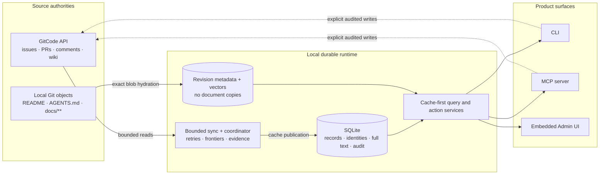

# gitcode-mcp

**A local, durable working set for GitCode — built for agents, operators, and
unreliable networks.**

`gitcode-mcp` synchronizes GitCode issues, pull requests, comments, wiki pages,
and repository documentation into a cache-first toolchain. Agents and humans
can keep searching, reading, planning, and inspecting history when GitCode is
slow or unreachable, then perform intentional live writes through the same
audited service boundary.

| Promise | What it means |
| --- | --- |
| **Useful offline** | Routine CLI, MCP, and Admin reads come from a durable local cache. |
| **Safe to automate** | Stable identities, typed failures, idempotency fences, bounded work, and deterministic evidence replace best-effort scripts. |
| **Local by design** | SQLite stores tracker/wiki records and derived indexes; repository documentation remains in Git and only metadata plus vectors are cached. |

The project is self-contained and public-safe. External repositories are inputs,
not bundled source material; examples and fixtures are sanitized.

## How It Works



GitCode remains the remote system of record. Local Git remains the repository
documentation store. The coordinator makes remote collection progress durable,
while every normal read stays independent from current network health.

## Product Surfaces

| Surface | Best for | Contract |
| --- | --- | --- |
| **CLI** | Setup, sync, search, diagnostics, explicit writes, migrations, and release operations | Human-readable or JSON output over the shared service layer |
| **MCP** | Agent search, citations, cached context, status, and policy-gated writes | stdio or HTTP/SSE with read-only and write-enabled discovery modes |
| **Admin UI** | Operating caches, jobs, coverage, documentation indexes, conflicts, and remediation | Session-protected UI embedded in the coordinator binary; loopback by default, with an explicit unsafe non-loopback development override |

All three surfaces expose the same cache identities and typed lifecycle state.
Machine-changing actions remain capability-gated; the browser never receives
arbitrary filesystem paths or provider credentials.

## Quick Start

Prerequisites: Go 1.22 or a published release binary, Git for repository-local
documentation, and a GitCode token only for live operations.

Install from source:

```sh
git clone https://gitcode.com/urandon/gitcode-mcp.git
cd gitcode-mcp
go build -o ./bin/gitcode-mcp ./cmd/gitcode-mcp
install -m 0755 ./bin/gitcode-mcp /usr/local/bin/gitcode-mcp
```

Or download a checksum-verifiable archive from the
[release page](https://gitcode.com/urandon/gitcode-mcp/releases) using the
[installation guide](docs/install.md).

Inside the Git worktree you want to operate:

```sh
gitcode-mcp repo init-local \
  --repo YOUR_OWNER/YOUR_REPO \
  --owner YOUR_OWNER \
  --name YOUR_REPO

gitcode-mcp auth status
gitcode-mcp sync \
  --repo YOUR_OWNER/YOUR_REPO \
  --issues --wiki --pulls --issue-comments --pr-comments

gitcode-mcp search \
  --repo YOUR_OWNER/YOUR_REPO \
  "retry failed cache maintenance"
```

`repo init-local` creates only trackable repository intent in
`.gitcode/gitcode-mcp.yaml`; generated SQLite state lives under ignored
`.gitcode/mcp/`. See [Secrets](docs/secrets.md) before the first live sync and
[Live Readiness](docs/live-readiness.md) for the complete setup check.

## From Search To Operations

### Search cached GitCode context

Hybrid search combines deterministic full text with an optional local semantic
namespace. It always preserves lexical results and reports when semantic
retrieval is unavailable instead of failing the whole query.

```sh
gitcode-mcp search --repo YOUR_OWNER/YOUR_REPO "writer contention"
gitcode-mcp search --repo YOUR_OWNER/YOUR_REPO --mode full_text "EX_CONFIG"
```

Results are grouped by source and include stable citations plus lexical and
semantic rank provenance. The same behavior is available through MCP
`search_sources`.

### Search documentation at an exact Git revision

The conventional repository-docs preset selects root `README*`, root
`AGENTS.md`, and `docs/**`. Corpus policy is versioned with the repository:

```yaml
# .gitcode/gitcode-mcp.yaml
cache_mode: repo-local
repository_docs:
  schema: 1
  enabled: true
  preset: conventional-docs-v1
```

Full-text mode reads exact local Git blobs without an embedding provider.
Hybrid mode stores reusable vectors and metadata, never document text. Moving
`HEAD` creates a new immutable revision identity rather than mutating old
citations. See [Repository documentation RAG](docs/repository-documentation-rag.md).

### Run resilient background maintenance

```sh
gitcode-mcp service install --overwrite
gitcode-mcp service start

gitcode-mcp maintenance plan --repo YOUR_OWNER/YOUR_REPO
gitcode-mcp maintenance enable \
  --repo YOUR_OWNER/YOUR_REPO \
  --yes \
  --idempotency-key initial-maintenance-policy

gitcode-mcp service jobs
gitcode-mcp admin open
```

The coordinator separates recent head refresh, historical tail backfill,
secondary comment coverage, and RAG repair. Bounded traversal, persisted
frontiers, typed contention, and retained job evidence make incomplete work
visible and safely resumable.

### Connect an MCP client

For an editor or agent that launches a child process:

```json
{
  "command": "gitcode-mcp",
  "args": ["--mcp"],
  "env": {
    "GITCODE_MCP_TOOL_ACCESS": "read"
  }
}
```

Use `write` access only when the client should discover mutation tools. Every
mutation still requires live intent, credentials, idempotency, provider
confirmation, and audit evidence. Shared clients can use the HTTP/SSE transport;
see [MCP Setup](docs/mcp-setup.md).

## Reliability By Design

- **Cache-first reads:** search, get, backlinks, snapshots, status, and Admin
  observation do not silently contact GitCode.
- **Durable synchronization:** bounded collection traversal, persisted
  frontiers, deterministic sync events, and retained job state make progress
  inspectable and resumable.
- **Network-aware failure handling:** partial responses, timeouts, rate limits,
  schema drift, and lock contention remain distinct, typed, and retryable where
  safe.
- **No duplicate blind writes:** mutations use idempotency claims and canonical
  readback; ambiguous results stay fenced instead of replaying a second write.
- **Stable identities:** local source ids survive provider aliases, project
  moves, and cache topology changes.
- **Inspectable operations:** jobs, coverage, retries, conflicts, and retained
  failures are visible in CLI, MCP, and the embedded Admin UI.
- **Deterministic testing:** default tests are offline. Browser CI asserts text,
  DOM/ARIA, JSON/API, actions, and state transitions—never screenshots or pixel
  baselines.

## Capability Map

| Job | Available capabilities |
| --- | --- |
| Read and search | Sources, chunks, snippets, backlinks, recent changes, hybrid/full-text retrieval, exact-revision documentation search |
| Synchronize | Issues, issue comments, wiki pages, pull requests, review comments, bounded daemon jobs, head/tail maintenance |
| Plan and write | Audited issues, comments, labels, milestones, PR metadata/review discussions, wiki pages, PR–issue links, push-mirror triggers |
| Diagnose and recover | Cache/schema status, typed provider failures, migrations, conflict resolution, job cancel/retry, RAG repair |
| Review and export | Deterministic snapshots/diffs, stable links, sync evidence, structured public-safe feedback |

## Documentation

| Start here | Document |
| --- | --- |
| Install and authenticate | [Install](docs/install.md) · [Secrets](docs/secrets.md) · [Config reference](docs/config-reference.md) |
| First live repository | [Live readiness](docs/live-readiness.md) · [Repository binding](docs/repo-binding.md) |
| Agent integration | [MCP setup](docs/mcp-setup.md) · [Read walkthrough](docs/read-walkthrough.md) · [Write walkthrough](docs/write-walkthrough.md) |
| Search and RAG | [RAG setup](docs/rag.md) · [Repository documentation RAG](docs/repository-documentation-rag.md) |
| Operate the service | [Cache maintenance](docs/cache-maintenance.md) · [Admin UI](docs/admin-ui.md) · [Cache and sync model](docs/cache-and-sync-model.md) |
| Understand the system | [Architecture](docs/architecture.md) · [Component architecture](docs/component-architecture.md) · [Test architecture](docs/test-architecture.md) |
| Contribute and release | [Agent guide](AGENTS.md) · [PR/MR workflow](docs/pr-mr-workflow.md) · [Release process](docs/release-process.md) |
| Safety and evidence | [Sanitization](docs/sanitization.md) · [GitCode API discovery](docs/gitcode-api-discovery.md) · [Structured feedback](docs/feedback.md) |

## Development

```sh
go test ./...
git diff --check
```

Frontend contributors also use `scripts/build-admin-ui.sh`; committed embedded
assets are checked so installing the Go binary does not require Node.js.

Active planning belongs in GitCode issues and pull requests. Durable historical
research and dogfood evidence belong in the GitCode wiki. See
[AGENTS.md](AGENTS.md) for the autonomous issue-to-release protocol and
[Sanitization Rules](docs/sanitization.md) for the public-safety contract.
