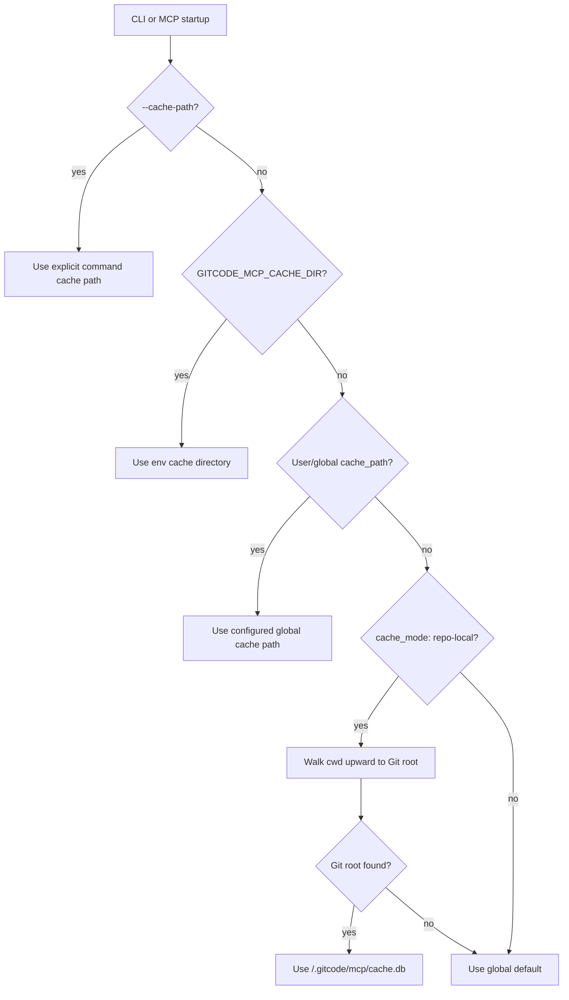

# Architecture

## Goal

Provide a cache-first tooling layer that lets AI agents and humans search, inspect, link, export, and eventually synchronize GitCode tracker/wiki data even when live GitCode access is slow, flaky, or unavailable.

## Non-Goals

- Do not require live GitCode network access for routine reads.
- Do not make remote issue ids replace stable source ids such as `DOC-123`.
- Do not hide writes behind automatic background sync.

## Components

| Component | Purpose |
| --- | --- |
| Source ingest | Read markdown, tracker, or wiki exports and extract source/task/page metadata. |
| Local cache | Store normalized records, full text, backlinks, identity map, remote metadata, sync status, and conflicts. |
| Link resolver | Resolve legacy ids, local paths, wiki pages, and remote issue/page ids. |
| GitCode adapter (fixture + live providers) | Encapsulate fixture/offline records and live tracker/wiki API calls, pagination, auth, rate limits, attachments, and write semantics. |
| CLI | Provide explicit commands for sync, search, get, link-check, export, diff, and diagnostics. |
| MCP server | Expose cache-first reads plus explicit live lifecycle tools for sync, index, diagnostics, and audited issue/PR writes. |
| Export snapshots | Produce deterministic markdown/JSON/SQLite snapshots for review, rollback, and audit. |

See [Component Architecture](component-architecture.md) for the durable component catalog, runtime flow, and boundary rules distilled from the historical design-package material.

## Provider Selection

Provider mode is resolved once at command start and does not switch while the command is running.

- `auto`: default mode. Cache read commands stay cache-first; GitCode-touching lifecycle commands select the live provider.
- `live`: selected for lifecycle commands when credentials resolve. `--live` remains accepted as a compatibility alias.
- `offline-fixture`: selected by explicit `--offline` or `--fixture`, and by write `--dry-run`. It uses deterministic fixture/offline providers for docs smoke and tests.
- `unavailable`: selected when a GitCode-touching command needs live credentials but none are available. The command fails with a credential diagnostic instead of silently falling back to fixtures.

Selection predicate:

| Predicate | Provider mode |
| --- | --- |
| cache read command | cache-first local service |
| lifecycle command plus credential | `live` |
| lifecycle command plus no credential | `unavailable` |
| `--offline` or `--fixture` | `offline-fixture` |
| write command plus `--dry-run` | `offline-fixture` validation |

## Credential Pipeline

Credentials are resolved in priority order:

1. `GITCODE_TOKEN` environment variable.
2. Keychain source when available. Native macOS Keychain support is optional, build-tag/platform gated, and no-ops on unsupported builds.
3. None. Live commands report auth/provider-unavailable diagnostics when no token is available.

`gitcode-mcp auth status` reports the credential source and a redacted token preview only. Tokens, raw `Authorization` headers, private repository coordinates, cookies, and raw API response bodies must not appear in CLI output, MCP responses, logs, fixtures, or test snapshots.

## Data Flow

```text
source markdown / tracker export / wiki export
        |
        v
source ingest -> local cache -> CLI / MCP reads
        |              |
        |              v
        |        export snapshots
        v
GitCode adapter <-> tracker/wiki remote state
```

Writes flow through explicit CLI or MCP live-write commands, require idempotency keys or deterministic write fingerprints, call the live GitCode adapter for provider confirmation, and then record audit/cache evidence. Routine reads continue to flow through the local cache and never trigger background writes.

## Repo-Local Cache Storage

The cache resolver supports two storage modes:

- `global`: the compatibility default. The cache lives in the OS/user cache directory or an explicit configured path.
- `repo-local`: an opt-in mode that keeps the SQLite cache next to the current Git worktree under `.gitcode/mcp/cache.db`.

Repo-local layout:

```text
<git-worktree>/
  .gitcode/
    gitcode-mcp.yaml
    mcp/
      cache.db
      cache.db.lock
      exports/
      snapshots/
```

The tracked config file is `.gitcode/gitcode-mcp.yaml`; generated cache state under `.gitcode/mcp/` should be ignored. This makes repository intent reviewable without committing SQLite databases, locks, exports, or snapshots.

Cache selection is resolved once at process startup:



Repo-local discovery reads `.gitcode/gitcode-mcp.yaml` from the discovered Git root. A user-level config may also set `cache_mode: repo-local`; the worktree still supplies the concrete root. Explicit cache paths and `GITCODE_MCP_CACHE_DIR` always win, which gives migrations and emergency diagnostics a stable escape hatch.

Migration is intentionally non-destructive. Existing global caches remain the default. Teams can opt into repo-local mode per worktree, then run normal `sync`, `index`, and `doctor` commands to populate and verify the new cache. No automatic copying from the global cache happens during startup; operators who want migration can export/sync again or use future explicit cache migration tooling.
