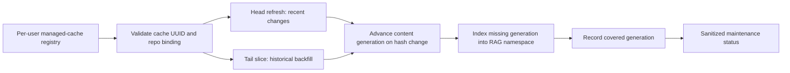

# Daemon Cache and RAG Maintenance

The local coordinator can maintain several independently created SQLite caches. The protocol is cache-identity based: a cache gets a durable random `cache_uuid` in schema version 17, while its filesystem path remains local service configuration and is never returned by MCP maintenance status.

## Lifecycle model



Maintenance uses two independent sync lanes:

- `head` refreshes a small recent window on an interval. It protects freshness and never claims historical completeness.
- `tail` gradually extends historical coverage. A bounded pass remains `backfilling`; only reaching the collection tail records `complete`.
- Secondary child coverage, such as comments, retains its own queue/frontier rather than making the parent head appear stale.

The first implementation conservatively replays page-number collections from page 1 and increases the tail bound. This is safe when newer records shift page boundaries because cached revisions make replay idempotent. A future cursor-capable adapter may resume more efficiently without changing the frontier contract.

## Invalidation and RAG repair

Schema version 17 tracks a monotonic `content_generation` per repository. SQLite triggers advance it only when a source or chunk is inserted, deleted, or receives a different `content_hash`; timestamp-only rewrites do not invalidate embeddings.

An index run captures the current generation after acquiring the writer lock. Successful indexing records `covered_generation` for its embedding namespace. If cache content changes during a run, the new generation remains uncovered, so the next reconciliation schedules repair. Chunk deletion already removes namespace embeddings through foreign-key cascade.

The maintenance dependency order is:

```text
validate identity -> sync head/tail -> observe content generation -> RAG repair -> publish status
```

Only one sync lane and one RAG writer may be active for a `(cache_uuid, repo_id)` pair. The same repository in a different cache is independent. Job coalescing also includes lane and namespace/chunk policy, preventing accidental cross-cache reuse.

## Registry and protocol

The daemon owns a versioned per-user `managed-caches.json` registry next to its runtime state. Enrollment resolves the real cache path, validates current schema, reads the durable cache identity, verifies the repository binding, and stores the registry with mode `0600`. A cache copied to a different path with the same UUID is reported as a clone instead of being silently treated as a new cache.

Low-level JSON-RPC methods are:

- `Maintenance.Enroll` — register a validated cache and policy with an idempotency key;
- `Maintenance.List` — return sanitized lifecycle state;
- `Maintenance.Reconcile` — run an immediate scheduler pass;
- `Maintenance.Disable` — stop scheduling a registration without deleting its cache.

Easy enrollment and policy presets are intentionally a separate setup surface. The supported operator diagnostics in this change are:

```sh
gitcode-mcp service maintenance
gitcode-mcp service maintenance --format json
gitcode-mcp service reconcile
```

Agents can call the read-only MCP tool `maintenance_status`. Results include cache UUID, a path fingerprint, repository, policy, generations, frontiers, jobs, and typed degraded state. They never include the raw cache path, provider credentials, cookies, or destination URLs.

## Failure and restart behavior

The registry and bounded job history survive daemon restart. Active jobs restored after a crash become `interrupted`; the next reconciliation validates the cache again and safely reschedules incomplete work. Identity replacement, unreadable caches, sync failures, and index failures become explicit degraded states. Disabling a registration is reversible and does not mutate cache content.
