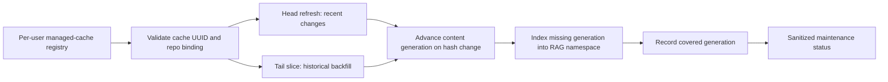

# Daemon Cache and RAG Maintenance

The local coordinator can maintain several independently created SQLite caches. The protocol is cache-identity based: a cache gets a durable random `cache_uuid` in schema version 17, while its filesystem path remains local service configuration and is never returned by MCP maintenance status.

## Lifecycle model



Maintenance uses two independent sync lanes:

- `head` refreshes a small recent window on an interval. It protects freshness and never claims historical completeness.
- `tail` gradually extends historical coverage. A bounded pass remains `backfilling`; only reaching the collection tail records `complete`.
- Secondary child coverage, such as comments, retains its own queue/frontier rather than making the parent head appear stale.

For page-number collections, each tail job reads a constant-size window beginning at its persisted `next_page` checkpoint. A head pass that reaches its bound before the previous complete watermark uses the same continuation until it proves freshness. Consecutive windows overlap by one page so newer records shifting page boundaries cannot create a gap. The deterministic wiki tree walker interprets the checkpoint as a logical path-order offset: it revisits directory metadata but skips already covered page bodies before reading the next bounded window. Collections maintained in the same job keep independent monotonic checkpoints; a slower collection cannot regress a faster one. Child coverage uses bounded work units too: issue comments drain the durable pending queue incrementally, while PR comments resume over stable cached-PR windows. Cached revisions make overlap replay idempotent. A future cursor-capable adapter may resume more efficiently without changing the frontier contract.

## Invalidation and RAG repair

Schema version 17 tracks a monotonic `content_generation` per repository. SQLite triggers advance it only when a source or chunk is inserted, deleted, or receives a different `content_hash`; timestamp-only rewrites do not invalidate embeddings.

An index run captures the current generation after acquiring the writer lock. Successful indexing records `covered_generation` for its embedding namespace. If cache content changes during a run, the new generation remains uncovered, so the next reconciliation schedules repair. Remote source replacement transactionally replaces that source's chunks; removed chunks delete their namespace embeddings through foreign-key cascade.

The daemon periodically resolves the configured embedding profile again even when generation coverage is current. A provider/model revision or effective configuration change therefore creates and selects its new namespace instead of leaving an older ready namespace current indefinitely. Explicit profile changes clear the previous namespace selection immediately.

The maintenance dependency order is:

```text
validate identity -> sync head/tail -> observe content generation -> RAG repair -> publish status
```

Only one sync lane and one RAG writer may be active for a `(cache_uuid, repo_id)` pair. The same repository in a different cache is independent. Job coalescing also includes lane, profile, and namespace/chunk policy, preventing accidental cross-cache reuse.

## Registry and protocol

The daemon owns a versioned per-user `managed-caches.json` registry next to its runtime state. Enrollment resolves the real cache path, validates current schema, reads the durable cache identity, and resolves the requested repository through the cache binding before deriving the registration id. The scheduler identity is therefore `(cache_uuid, canonical_repo_id)`; aliases are retained only as sanitized lookup/display metadata and cannot create a second schedule. The registry is stored with mode `0600`. It also stores the exact non-secret effective configuration snapshot and its hash privately with the registration. Jobs therefore use the configuration that was planned and confirmed instead of rediscovering profiles from the daemon's working directory or environment. Neither the snapshot nor its local config reference is present in public status output. A cache copied to a different path with the same UUID is reported as a clone instead of being silently treated as a new cache.

Registry version 2 migrates older alias-derived registrations on load. Compatible duplicates coalesce deterministically into the canonical registration while preserving the newest lifecycle evidence, conservative failed-stage backoff, idempotency receipts, terminal job ids, and durable redirects from legacy registration ids. A later successful stage supersedes an older failure. Repository-document compatibility compares immutable source authority (Git/worktree refs, local-authority fingerprint, and profile), not mutable indexing stage or source registration id. Equivalent authorities receive one canonical source id and durable redirects for historical source/job selectors; distinct authorities fail closed.

Conflicting policy/config/source candidates become one disabled `identity_conflict`; temporarily unavailable duplicate aliases become one `identity_unresolved` cohort; and every registration sharing one cache UUID across multiple canonical path fingerprints becomes one UUID-global `cache_clone_conflict`, even when repository bindings differ. Ordinary enrollment and reconciliation cannot silently select a winner. The private registry retains paired candidate bundles containing the complete registration, effective config snapshot/reference, repository-document sources, path authority, and prior enabled state. Public observations expose only the canonical id, known aliases, legacy registration ids, paired sanitized hashes/fingerprints, and prior enabled status.

Admin conflict resolution requires an explicit candidate; display order and recency never select one. For an identity/policy/source conflict the candidate is one repository authority. For a clone conflict the candidate is one opaque physical-path cohort containing every repository registration on that cache authority; selecting it never selects one repository as the winner for the whole cache. Plan and apply revalidate the selected cache UUID, every canonical repository binding, and each config snapshot/hash pair. Apply first installs a cache-UUID writer-admission fence and refuses while any sync, RAG, repository-document, or synchronous Admin binding writer is active or still unwinding. Direct writer requests resolve their cache path to the durable UUID before admission, so omitting the UUID cannot bypass the fence; Admin binding apply reserves the same UUID writer lane before it replans and writes SQLite.

Clone apply restores every selected-path registration and source bundle, retires only the unselected path fingerprints, and then reruns ordinary per-repository canonicalization. Distinct repositories remain distinct; compatible aliases merge; incompatible policies or sources remain a follow-up `identity_conflict`. Enrollment receipts and repository-document pending/cancellation admissions carry the opaque physical-authority fingerprint; clone resolution projects only exact selected-path records back to live repository identities. Legacy records without a path are rebound only when the selected candidate supplies one unique exact intent/source match, otherwise they remain fail-closed. Rejected repositories' historical jobs are never relabelled through the synthetic clone-selection row. Registration and source redirect projection follows complete acyclic chains. The registry mutation and a bounded durable idempotency receipt share one atomic write, so a failed write rolls back both and a retained replay after restart cannot repeat the mutation. A lossy legacy conflict without paired private candidates remains blocked and reports that supported recovery evidence is unavailable.

Low-level JSON-RPC methods are:

- `Maintenance.Enroll` — register a validated cache and policy with an idempotency key;
- `Maintenance.List` — return sanitized lifecycle state;
- `Maintenance.Reconcile` — run an immediate scheduler pass;
- `Maintenance.ReconcileRegistration` — reconcile only one newly enrolled registration;
- `Maintenance.ResolveConfig` — validate an enrollment snapshot and return only its hash and selected RAG identifiers;
- `Maintenance.Disable` — stop scheduling a registration without deleting its cache.

## One-command setup

The setup surface composes the registry and scheduler above instead of introducing another daemon protocol. Planning is read-only and deterministic for a selected cache identity, repository binding, effective non-secret configuration, daemon protocol, provider/model configuration revision, and requested policy:

```sh
gitcode-mcp maintenance plan --repo YOUR_OWNER/YOUR_REPO
gitcode-mcp maintenance enable \
  --repo YOUR_OWNER/YOUR_REPO \
  --yes \
  --idempotency-key workstation-setup-1
```

`enable` always renders the same plan internally, revalidates its identity immediately before applying it, waits for a newly launched daemon to advertise a compatible maintenance protocol, verifies that daemon's view of the configuration hash, runs a real embedding smoke request, enrolls the cache through `Maintenance.Enroll`, and reconciles only that registration. Existing active work is coalesced by the #79 job keys. Replaying the same idempotency key resumes the same registration instead of duplicating work; reusing it with a different policy or configuration returns `idempotency_conflict`.

Useful policy controls are `--sync off|head|head-and-backfill`, `--collections issues,issue-comments,wiki,pulls,pr-comments`, `--rag off|maintain`, `--profile`, `--detach`, `--no-service-install`, and `--no-model-download`. `rag enable` is a compatibility shortcut for `maintenance enable`. In a terminal it can render and confirm the plan interactively, deriving a deterministic opaque operation key from that exact plan. Non-interactive callers must use `--yes --idempotency-key KEY` and reuse the key on retry.

Every plan lists effects by class (`inspect`, `local_config_write`, `local_service_change`, `large_download`, `provider_data_transfer`, and `job_enqueue`), includes a hash of the full effective non-secret configuration, and declares the configured provider data boundary (`local_process`, `local_network`, `remote`, or `unknown`). `--yes` confirms only the rendered plan; a changed cache identity, binding, configuration, provider/model configuration revision, service state, or policy produces `stale_plan` and requires a new plan.

MCP clients use `maintenance_plan` followed by `enable_cache_maintenance` with `write_mode=live`, the returned `plan_id`, and an idempotency key. The selected MCP process cache is implicit: neither tool accepts or returns a filesystem path. MCP apply can enroll and enqueue an already-ready setup, but it never installs a user service, starts a provider, or downloads a model. Those effects return `confirmation_required` with an exact CLI handoff.

The plan and apply statuses are `ready`, `refreshing`, `indexing`, `backfilling`, `confirmation_required`, or `blocked`. `refreshing` is a bounded head update, while `backfilling` is historical tail work. The result separately answers whether enrollment completed and which initial jobs were coalesced; it does not claim a historically complete corpus merely because maintenance is enabled. Provider setup failures include a typed failure class, sanitized diagnostic, and remediation handoff.

The supported operator diagnostics are:

```sh
gitcode-mcp service maintenance
gitcode-mcp service maintenance --format json
gitcode-mcp service reconcile
```

Agents can call the read-only MCP tool `maintenance_status`. Results include cache UUID, a path fingerprint, canonical repository id, known aliases and legacy registration references, policy, generations, frontiers, jobs, and typed degraded state. They never include the raw cache path, provider credentials, cookies, or destination URLs.

When cache identity evidence conflicts, the text and JSON diagnostics expose only public-safe candidate references, path fingerprints, repository/registration cohorts, policy and configuration hashes, and repository-document source authority hashes/references. Physical cache cohorts also include their member evidence so an operator can make the same deterministic selection in either format without revealing a filesystem path.

## Failure and restart behavior

The registry and bounded job history survive daemon restart. Active jobs restored after a crash become `interrupted`; the next reconciliation validates the cache again and safely reschedules incomplete work. Identity replacement, unreadable caches, sync failures, and index failures become explicit degraded states. A persisted enrollment whose configuration snapshot hash or cache authority no longer matches its registration is disabled as `config_snapshot_invalid`; reconciliation remains blocked until the snapshot is repaired and revalidated.

Sync and RAG failures are tracked independently. Each failed stage keeps a sanitized error class and uses persisted exponential retry backoff from one minute up to 64 minutes; success of that same stage clears its failure state. A backed-off stage does not prevent healthy work in the other stage. Disabling a registration is reversible and does not mutate cache content.
