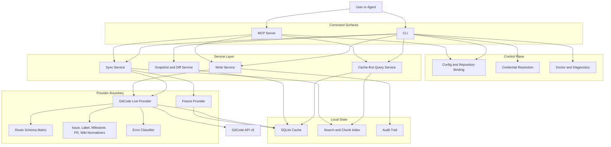

# Component Architecture

This document is the durable component form of the old generated design-package notes. It keeps the architecture and component responsibilities, but drops iteration scaffolding, task ledgers, generated validations, and historical package metadata.

## Runtime Shape

## Component Catalog

| Component | Code Area | Responsibility | Durable Contract |
|---|---|---|---|
| CLI | `cmd/gitcode-mcp/`, `internal/cli/` | Parses commands, resolves startup options, routes reads, sync, writes, config, auth, doctor, and cache commands. | Cache reads remain offline; GitCode-touching lifecycle commands use live provider by default unless `--offline`, `--fixture`, or write `--dry-run` is explicit. |
| MCP server | `internal/mcp/` | Exposes cache-first read tools, sync lifecycle tools, and configured write lifecycle tools to agents. | Tool availability is policy-driven. Write tools use the same service paths as CLI writes. |
| Capability registry | `internal/capability/` | Declares shared operation metadata, surface availability, safety class, and explicit CLI-only/MCP-only exceptions. | New write capabilities should be added through the registry; dangerous or intentionally asymmetric surfaces require a reason and tests. |
| Service layer | `internal/service/` | Owns command use cases, cache orchestration, sync graph commits, write confirmations, snapshots, diffs, and link checks. | Business behavior lives here rather than inside CLI or MCP transports. |
| Repository binding | `internal/config/`, `internal/service/` | Maps a stable repo id to owner, repo name, scopes, aliases, API base URL, and cache configuration. | Repository id is the local routing key. Remote ids are aliases, not replacements. |
| Credential resolution | `internal/auth/`, `internal/credential/`, `internal/config/` | Resolves environment and credential-store tokens and reports redacted status. | Tokens never enter logs, docs, fixtures, snapshots, or MCP responses. Missing credentials fail closed for live mode. |
| Doctor and diagnostics | `internal/doctor/`, `internal/diagnostics/` | Reports effective runtime state and normalized failure classes. | Diagnostics are typed and public-safe; raw API bodies and secret material are redacted. |
| Cache store | `internal/cache/` | Persists sources, identities, links, comments, chunks, revisions, sync events, locks, and schema migrations. | Reads are cache-first. Schema versioning and WAL keep routine reads deterministic and concurrent. |
| Indexer | `internal/index/` | Parses markdown, headings, stable ids, links, anchors, chunks, and freshness state. | Indexed chunks carry provenance and citations needed by CLI/MCP reads and snapshots. |
| GitCode provider boundary | `internal/gitcode/` | Defines provider interfaces, fixture behavior, live HTTP adapter, API models, route matrix, pagination, and write confirmation. | Live API shape decisions stay behind this adapter. Fixture mode remains deterministic and network-free. |
| Route schema matrix | `internal/gitcode/route_schema_matrix.go` | Declares supported, deferred, and unsupported route families by product area. | Unsupported or deferred capabilities return explicit diagnostics instead of empty success. |
| Normalizers | `internal/gitcode/*normalizer*.go`, provider model code | Converts GitCode issue, label, milestone, pull request, comment, and wiki shapes into cache/service records. | GitCode-specific field quirks are handled here, not scattered through services. |
| Wiki provider | `internal/gitcode/http_client.go` | Traverses `{repo}.wiki` through `/contents`, reads `/raw`, and writes wiki pages through base64 content plus `sha` semantics. | Wiki uses token-compatible API v5 repository routes, not browser-session `web-api` routes. |
| Error classifier | `internal/gitcode/errors.go`, `internal/diagnostics/` | Separates API validation, schema decode, credential/config, transport, rate-limit, and unsupported capability failures. | 4xx API failures, malformed JSON, and network failures must not collapse into generic internal errors. |
| Audit trail | `internal/audit/`, `internal/service/` | Records non-secret write confirmations and idempotency evidence. | Writes are reviewable and replay-safe without storing tokens or raw private payloads. |
| Test network harness | `internal/testnet/`, package tests, `docs/test-architecture.md` | Provides offline HTTP-compatible test surfaces for live-provider behavior and keeps unit, offline integration, fixture, and live E2E boundaries explicit. | `go test ./...` must pass without real network, credentials, Keychain, or SSH agent. |

## Primary Flows

### Cache-First Read

1. CLI or MCP receives a read request.
2. Repository binding resolves the local repo id.
3. Service layer reads SQLite records, links, chunks, and identities.
4. CLI or MCP returns sanitized records without contacting GitCode.

### Live Sync

1. Caller runs a GitCode-touching lifecycle command; `--live` is accepted as a compatibility alias, while `--offline`/`--fixture` select deterministic fixture mode.
2. Credential and repository binding are resolved before HTTP work starts.
3. Live provider fetches selected collections through GitCode API v5.
4. Normalizers convert remote records into cache graphs.
5. Service layer commits records, comments, identities, links, revisions, and sync events.
6. Index refresh derives chunks and link state for later offline reads.

### Explicit Write

1. Caller invokes a write command or enabled MCP write tool.
2. Service layer validates repo scope, write mode, idempotency, and required fields.
3. Live provider performs the GitCode API call and confirms the remote result.
4. Service layer writes audit evidence and updates cache state.
5. CLI or MCP returns a sanitized confirmation.

### Snapshot And Diff

1. Service layer reads cache sources, identities, links, chunks, and revisions.
2. Snapshot export sorts records deterministically.
3. Diff compares two snapshots without live access.
4. Output is safe to review and commit when it uses placeholder data.

## Boundary Rules

- CLI and MCP are transports. Shared behavior belongs in `internal/service/`.
- Live API quirks belong in `internal/gitcode/`, guarded by tests and route-schema evidence.
- Cache migrations must be explicit and versioned. Routine reads should not take the writer lock when the schema is current.
- Writes are never implicit background side effects of reads.
- GitCode wiki files should use explicit `.md` paths for durable pages.
- Historical design-package evidence belongs in git history or wiki summaries, not in main.

## Related Docs

- [Architecture](architecture.md)
- [Cache And Sync Model](cache-and-sync-model.md)
- [GitCode API Discovery](gitcode-api-discovery.md)
- [MCP Setup](mcp-setup.md)
- [PR/MR Workflow](pr-mr-workflow.md)
- [Sanitization Rules](sanitization.md)
