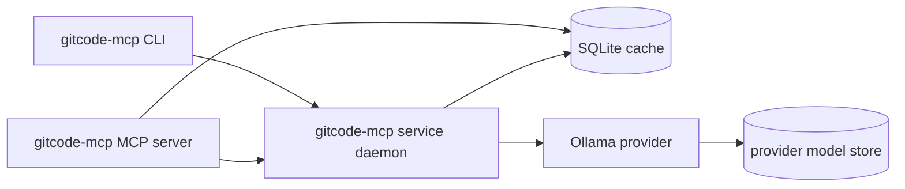

# RAG Setup and Operation

This page documents the RAG setup tracked by the [#33 design umbrella](https://gitcode.com/urandon/gitcode-mcp/issues/33). The goal is local semantic/hybrid retrieval over cached GitCode sources without making normal cache reads depend on a live model provider.

RAG is additive to the cache:

- GitCode records, comments, wiki pages, pull requests, chunks, and sync logs remain ordinary SQLite cache data.
- Embeddings live in model-scoped namespaces.
- Changing the embedding model or RAG profile invalidates only the RAG namespace. It does not delete cached GitCode records or chunk text.

## Default Profile

The built-in default profile is `qwen3-ollama-0_6b-1024`:

| Setting | Value |
|---|---|
| Provider | `ollama` |
| Provider endpoint | `http://127.0.0.1:11434` |
| Model | `qwen3-embedding:0.6b` |
| Dimensions | `1024` |
| Max input tokens | `512` |
| Index batch size | `16` |
| Search mode | hybrid semantic + lexical |

This profile targets small local machines first. A Mac mini M4 Pro with 24 GB unified memory should have enough room to run one Ollama embedding provider plus `gitcode-mcp` service and clients, as long as large model families are not loaded at the same time.

## Components

RAG uses three runtime roles:



`gitcode-mcp` and `gitcode-mcp service run` are the same codebase. The daemon owns long-running local jobs such as `rag index`; CLI and MCP surfaces observe job status through the same local service state.

Collection sync can also use the same service job queue for large repositories:

```sh
gitcode-mcp sync --repo YOUR_OWNER/YOUR_REPO --issues --pulls --pr-comments --daemon
```

Use `--detach` to return the job id immediately, then inspect or control it through `gitcode-mcp service jobs`, `gitcode-mcp service attach JOB_ID`, and `gitcode-mcp service cancel JOB_ID`.

Daemon job state is a bounded service runtime snapshot, not part of the GitCode cache or RAG index. The service keeps active jobs plus the latest 128 terminal jobs, and trims each job to the latest 256 progress events.

Ollama is a provider runtime. It may already be running, or `rag setup` can autostart `ollama serve` when the provider is configured with managed startup.

## Install Service

Install the local service once per user:

```sh
gitcode-mcp service install
gitcode-mcp service status
gitcode-mcp service doctor
```

Useful service commands:

| Command | Purpose |
|---|---|
| `gitcode-mcp service install` | Writes the platform user-service definition for `gitcode-mcp service run`. |
| `gitcode-mcp service status` | Shows whether the local service is installed and running. |
| `gitcode-mcp service doctor` | Uses the same state model as status, with health diagnostics. |
| `gitcode-mcp service run` | Runs the service in the foreground for debugging. |
| `gitcode-mcp service uninstall` | Removes the user-service definition. |

## Install Provider

Default provider setup with Ollama:

```sh
brew install ollama
ollama serve
ollama pull qwen3-embedding:0.6b
```

Then let `gitcode-mcp` verify the provider, model, and embedding endpoint:

```sh
gitcode-mcp rag setup --dry-run
gitcode-mcp rag setup --yes
```

`--dry-run` reports missing actions without pulling a model. `--yes` is allowed to pull the configured model and run a small embedding smoke test.

## Model Storage

Models are not repository-local state and should not be committed. Keep them in a global or disk-specific path.

`gitcode-mcp` has a general RAG model store path:

```sh
export GITCODE_MCP_RAG_MODEL_STORE=/Volumes/models/gitcode-mcp
```

For Ollama-owned models, configure Ollama's model path:

```sh
export OLLAMA_MODELS=/Volumes/models/ollama
ollama serve
```

Equivalent YAML:

```yaml
rag:
  model_store_path: /Volumes/models/gitcode-mcp
  providers:
    ollama:
      endpoint: http://127.0.0.1:11434
      executable: ollama
      startup: managed
      autostart: true
      env:
        OLLAMA_MODELS: /Volumes/models/ollama
      model_storage:
        mode: provider-owned
        env: OLLAMA_MODELS
```

Repo-local configs may tune profiles and search settings, but they must not put `rag.model_store_path`, `service.runtime_dir`, or provider-owned model storage under `.gitcode/`. Those paths are machine-level state, not repository artifacts.

## First Index

Populate cache data first:

```sh
gitcode-mcp repo add --repo YOUR_OWNER/YOUR_REPO --owner YOUR_OWNER --name YOUR_REPO --scopes issues,wiki,pulls
gitcode-mcp sync --repo YOUR_OWNER/YOUR_REPO --issues --wiki --pulls --pr-comments
```

Start indexing through the daemon:

```sh
gitcode-mcp rag index --repo YOUR_OWNER/YOUR_REPO
```

By default the CLI attaches until the daemon job reaches a terminal state. Use `--detach` when another client will observe progress.

Check coverage:

```sh
gitcode-mcp rag status --repo YOUR_OWNER/YOUR_REPO
gitcode-mcp rag-status --repo YOUR_OWNER/YOUR_REPO
```

Search:

```sh
gitcode-mcp rag search --repo YOUR_OWNER/YOUR_REPO "rate limit during sync"
gitcode-mcp rag-search --repo YOUR_OWNER/YOUR_REPO "rate limit during sync"
```

MCP clients should use:

| MCP tool | Purpose |
|---|---|
| `rag_status` | Provider readiness, namespace, coverage, last run, and active job state. |
| `rag_search` | Semantic/hybrid retrieval with citations, source ids, snippets, and score breakdowns. |
| `service_status` | Local daemon liveness. |
| `service_jobs` / `service_job_status` | Background job visibility. |

## Namespace Invalidation

An embedding namespace identity includes:

- repository id;
- profile id, provider id, provider type;
- model id and model revision;
- dimensions, dtype, and normalization;
- document and query instruction ids;
- chunk policy id and language policy id;
- RAG config hash.

Any of those changes create a different namespace. The old cache and chunks remain readable; only semantic coverage for the new namespace is missing until `rag index` runs again.

Common invalidation examples:

| Change | Result |
|---|---|
| Pulling a new digest of the same Ollama model | New namespace if the provider reports a new revision. |
| Switching from `qwen3-embedding:0.6b` to another model | New namespace. |
| Changing dimensions or normalization | New namespace; previous vectors are not reused. |
| Changing chunk size or language policy | New namespace because chunk/query behavior changed. |
| Re-syncing issues without profile changes | Existing namespace remains valid for unchanged chunks; new or changed chunks become missing/stale until reindexed. |

## Recovery

| Symptom | What to check |
|---|---|
| `missing_provider` | Install Ollama or update `rag.providers.ollama.executable`. |
| `provider_not_running` | Run `ollama serve`, then `gitcode-mcp rag setup --dry-run`. |
| `missing_model` | Run `gitcode-mcp rag setup --yes` or `ollama pull qwen3-embedding:0.6b`. |
| `smoke_failed` | Check endpoint, model name, dimensions, and provider logs. |
| `no_namespace` | Run `gitcode-mcp rag index --repo YOUR_OWNER/YOUR_REPO`. |
| Partial coverage | Run `gitcode-mcp rag status --repo YOUR_OWNER/YOUR_REPO`, then re-run `rag index`. |
| Dimension mismatch | The model/profile changed; keep the new profile and reindex. |

## Evaluation And CI

Multilingual deterministic fixtures live under `testdata/rag/eval/` and cover Russian, Chinese, and English retrieval cases.

Normal CI uses fake-provider tests and does not download large models. Optional real-model smoke tests are opt-in:

```sh
GITCODE_MCP_RAG_REAL_SMOKE=1 \
GITCODE_MCP_RAG_PROVIDER_ENDPOINT=http://127.0.0.1:11434 \
GITCODE_MCP_RAG_REAL_MODEL=qwen3-embedding:0.6b \
GITCODE_MCP_RAG_REAL_DIMENSIONS=1024 \
go test ./internal/rag -run TestOptionalOllamaRealModelSmoke
```

If Ollama or the model is missing, the smoke test skips cleanly. Other provider failures fail the test.

## Vector Store Escalation

The MVP stores vectors in SQLite and performs an exact scan over the active namespace. That keeps dependencies small and predictable while caches are modest.

Escalate to `sqlite-vec` when exact scan becomes the measured bottleneck, especially around:

- tens of thousands of embedded chunks per active namespace;
- unacceptable P95 search latency on the Mac mini target;
- CPU or battery cost that is visible during repeated searches;
- a need for ANN-style vector indexes while keeping SQLite deployment ergonomics.

Escalate to an external vector database only when local SQLite-style storage is no longer the product shape:

- shared multi-user or multi-machine indexes;
- high concurrent write/search load;
- remote service deployment;
- advanced ANN/filtering/replication requirements that justify another service.

Until those conditions are measured, SQLite exact scan is the simplest operational baseline.
