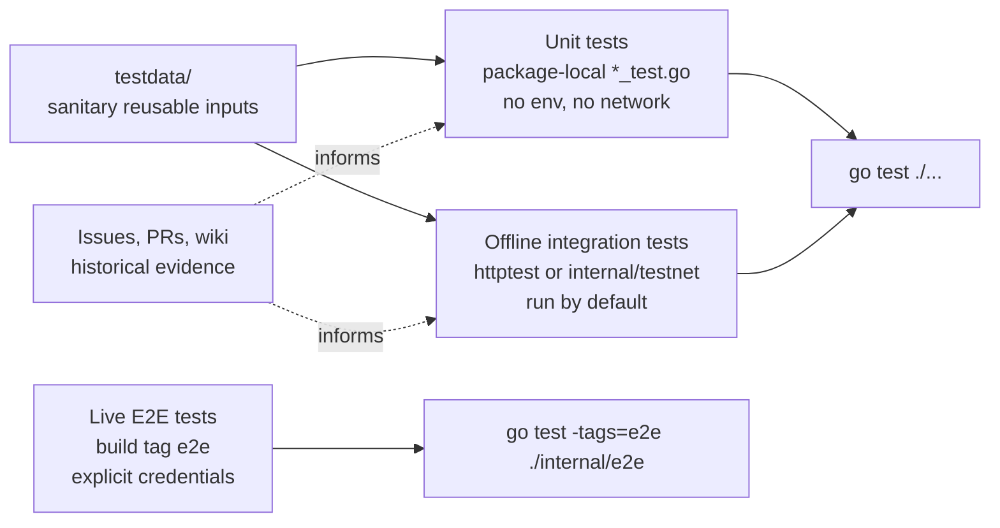

# Test Architecture

This repository keeps tests close to the code they verify. Do not add generated
design packages, captured work logs, or ad hoc harness dumps to `main`; keep
historical evidence in GitCode issues, pull requests, or wiki pages.

For the migration record of the old generated `tests/design_package` tree, see
`docs/test-intent-migration.md`.

## Test Categories



| Category | Location | Default run | Rules |
| --- | --- | --- | --- |
| Unit tests | Next to the package under `cmd/` or `internal/` | Yes | No live network, credentials, Keychain, SSH agent, or machine-local paths. Use package fakes and `t.TempDir()`. |
| Offline integration tests | Package-local tests using `httptest`, `internal/testnet`, temp SQLite caches, or CLI/MCP entrypoints | Yes | May exercise multiple packages, but must remain loopback-only and deterministic. |
| Live E2E tests | `internal/e2e/` | No | Must use `//go:build e2e`, explicit environment variables, redacted logs, and skip when credentials are absent. |
| Fixture inputs | `testdata/` | Indirectly | Store only sanitized reusable inputs. Do not store generated design artifacts or raw API captures. |
| Historical evidence | GitCode wiki, issue comments, PR reports, git history | No | Use for research, dogfood notes, decisions, and exploratory output that should remain discoverable without living in `main`. |

## Naming Rules

- Prefer package-local `_test.go` files over a top-level `tests/` directory for
  Go behavior.
- Name reusable HTTP fakes by behavior, such as `mock_gitcode_api_test.go`, and
  keep them in the package that owns the surface they verify unless another
  package needs the same helper.
- Move reusable offline HTTP helpers to `internal/testnet` when more than one
  package can reasonably use them.
- Use neutral fixture names such as `offline-smoke`, `example-repo`, or
  `sanitized-*`. Avoid names that describe local dogfood history.
- Use `TestE2E...` only for live tests behind the `e2e` build tag.
- Use `TestIntegration...` only when a test crosses package or process
  boundaries; it still must be offline unless it also lives behind `e2e`.

## Live Test Contract

Live tests must be opt-in:

```sh
go test -tags=e2e ./internal/e2e
```

They must read credentials from explicit environment variables, redact tokens,
repository coordinates, and authorization headers from logs, and skip instead of
failing when the environment is not configured. The default suite must keep this
contract:

```sh
go test ./...
```

`go test ./...` must pass without network access, credentials, Keychain access,
or an SSH agent.

## Fixture Boundary

Fixtures are code inputs, not evidence archives. Before adding or changing a
fixture, check that it is:

- public-safe and sanitized;
- small enough to review in a pull request;
- reusable by a deterministic test;
- free of raw tokens, cookies, private repository names, internal URLs, and
  machine-local paths.

Captured research, migration notes, dogfood reports, and generated design
packages belong in wiki pages or issue/PR comments when they are still useful.

## Before Committing

Run:

```sh
go test ./...
git diff --check
```

For changes that touch live E2E behavior, also run or explicitly report why you
could not run:

```sh
go test -tags=e2e ./internal/e2e
```
