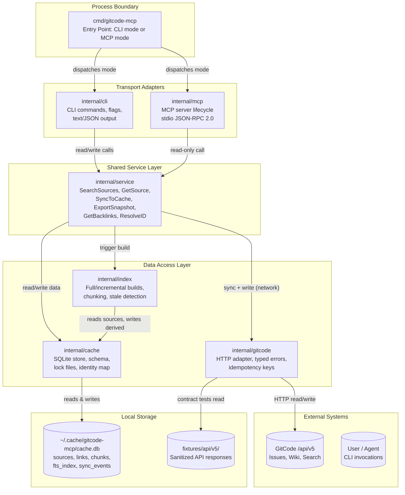

# Design Package Architecture

This file is copied from the approved Triborg design package during implementator preflight.

# Architecture

## Need
The architecture delivers a cache-first Go CLI and MCP server that ingests local markdown sources (agent knowledge layer) and GitCode tracker/wiki data into a SQLite cache, exposes read operations through a unified service layer, and gates all writes behind explicit commands with idempotency keys. Every routine read completes without network access; MCP and CLI share the same internal service layer so agent workflows map directly to cache reads.

- Replace shell-based agent read workflows (`find`, `rg`, `sed`) with structured cache-first CLI/MCP tools that produce semantically equivalent output offline.
- Define a SQLite schema that stores normalized source records, links/backlinks, identity map, remote revisions, sync events, conflicts, and deterministic chunks with byte offsets and heading paths.
- Expose the same read operations through both CLI commands and MCP JSON-RPC tools, with identical structured output contracts.
- Provide an explicit sync command that ingests remote GitCode data (and local file sources) into cache with idempotency keys, lock files, and audit logs, never overwriting local-only data.
- Define a chunk/provenance model (byte offsets, line ranges, heading paths, content hash, inherited metadata) so a future RAG layer can compose over the same authoritative cache without migration.
- Define typed error contracts for every degraded-network failure mode (timeout, rate limit, auth expiry, conflict, partial response, corruption, collision) with cache-safety guarantees.

- Multi-instance GitCode federation — assumption §9 explicitly scopes the first version to a single instance.
- HTTP/SSE MCP transport — assumption §3 defers this; stdio transport is the initial target.
- Write operations over MCP in the first slice — writes are CLI-only initially; MCP write tools are deferred to a later version.
- Embedding provider integration, vector database selection, reranking, semantic answer generation, chat memory, model-specific tuning — all deferred per Task 9.
- Real-time or push-based sync — sync is explicitly triggered by the user; no persistent daemon or watcher.
- Migration from another language — assumption §1 confirms Go is the starting point.

## Approach
### Overview
### Layered Dependency Direction

```
cmd/gitcode-mcp          (entry point: wires services, dispatches CLI or MCP)
        |
internal/service         (unified read/write service layer — all business logic)
   /       |       \
cache   gitcode   index   (data access, remote adapter, derived projections)
```

Dependencies flow strictly downward: `cmd` → `service` → `cache|gitcode|index`. No package imports upward. `cache`, `gitcode`, and `index` are peers that never import each other; `service` orchestrates cross-cutting operations.

### Key Component Contracts

**`internal/cache`** — owns the SQLite schema, record accessors, and a `Store` interface. Exposes typed methods: `UpsertSource`, `GetSource`, `ListSources`, `UpsertLink`, `GetBacklinks`, `GetIdentityMap`, `UpsertChunk`, `GetChunks`, `RecordSyncEvent`, `GetSyncStatus`, `UpsertConflict`, `GetConflicts`, `AcquireLock`, `ReleaseLock`. The store is the sole writer to the SQLite database; all other packages read and write through the store.

**`internal/gitcode`** — owns the HTTP adapter to GitCode `/api/v5`. Exposes a `Client` interface with methods for issue CRUD, wiki page CRUD, search, comments, and attachments. Every method accepts a context.Context and returns structured data plus a typed error from the `Err*` family (details in API Interoperability Contract). This package never touches `cache` or `service` types directly.

**`internal/index`** — owns derived-index computation and staleness detection. Exposes `FullBuild` and `IncrementalBuild` methods that read sources from cache, parse frontmatter/headings/links, compute derived projections, and write back-derived indexes. `StaleCheck` compares content hashes to detect out-of-date derived records without rebuilding.

**`internal/service`** — owns the business-logic layer. Exposes methods like `SearchSources`, `GetSource`, `ListSources`, `GetBacklinks`, `ResolveID`, `GetSyncStatus`, `SyncToCache`, `ExportSnapshot`, `DiffSnapshot`, `GetSnippet`. Each method dispatches to the necessary `cache` and `gitcode` (and optionally `index`) primitives. The MCP server and CLI call this same layer.

**`internal/mcp`** — owns the JSON-RPC server lifecycle over stdio transport. Reads stdin for requests, dispatches to `service` methods, writes JSON-RPC responses to stdout. Defines the MCP tool definitions as data and maps each `tools/call` method name to a `service` call.

**`internal/cli`** — owns the CLI command tree, flag parsing, output formatting (human `path:line:snippet` and machine JSON), and main dispatch loop. Maps each subcommand (`search`, `get`, `backlinks`, etc.) to `service` method calls with the same signatures used by the MCP server.

### Invariants
- Routine reads (search, get, backlinks, resolve, export, diff, sync-status) never touch the network. Only explicit `sync`, `ingest` (when network sources are requested), and write commands (create/update issue/wiki) access the GitCode adapter.
- The cache is the single source of truth for local operations. Remote data is ingested into the cache; no live API call substitutes for a missing cache record during read operations.
- Stable source ids (`DOC-123`, `TASK-0202`) are primary keys in the identity map. Remote GitCode issue/wiki ids are aliases that resolve through the identity map.
- Writes to GitCode are never triggered by reads. The `sync` command is the only automated writer; `create-issue`, `update-issue`, `create-page`, etc. are explicit subcommands.

### Architecture Diagram


### Components
- `internal/cache` — Owns SQLite schema, record accessors, lock-file acquisition, and cache integrity. Sole writer to the database.
- `internal/gitcode` — Owns GitCode `/api/v5` HTTP adapter with typed error family and pagination. Never imports cache or service types.
- `internal/index` — Owns derived-index computation: full/incremental builds, chunking, stale detection. Reads cache, writes derived records.
- `internal/service` — Owns business-logic orchestration layer. SearchSources, GetSource, SyncToCache, ExportSnapshot, etc. Unified API for CLI and MCP.
- `internal/mcp` — Owns MCP server lifecycle over stdio transport, JSON-RPC 2.0 framing, tool definitions.
- `internal/cli` — Owns CLI command tree, flag parsing, output formatting (human/JSON).
- `cmd/gitcode-mcp` — Entry point. Selects CLI mode or MCP mode (`--mcp`).

### Requirement Coverage
| Request Task | Architecture Resolution | Components | Interfaces / Flow | Risk | Validation |
|---|---|---|---|---|---|
| Task 1 | Define package layout with `cmd/gitcode-mcp` → `internal/service` → `internal/{cache,gitcode,index,mcp,cli}`. Strict downward dependency; no circular imports. `go build ./...` compiles all packages. | `cmd/gitcode-mcp`, `internal/service`, `internal/cache`, `internal/gitcode`, `internal/index`, `internal/mcp`, `internal/cli` | `cmd` imports `cli` and `mcp`, each imports `service`, which imports `cache`, `gitcode`, `index` (peers). | None. Layout follows standard Go `internal/` conventions. | `go build ./...` from repo root; every package compiles without circular imports. |
| Task 2 | SQLite schema with tables: `sources`, `fts_index` (FTS5 virtual table), `identity_map`, `links`, `remote_revisions`, `sync_events`, `conflicts`, `chunks`. Chunk uniqueness constraint on `(source_id, content_hash)`. Backlink query: `SELECT s.* FROM sources s JOIN links l ON s.id = l.source_id WHERE l.target_id = ?`. | `internal/cache` | `Store` interface methods: `UpsertSource`, `GetSource`, `ListSources`, `UpsertLink`, `GetBacklinks`, `UpsertChunk`, `GetChunks`, etc. In-memory SQLite for tests. | Schema migration errors; FTS5 requires SQLite compiled with FTS5 support (confirmed in `modernc.org/sqlite`). | Go test opens in-memory SQLite, inserts source + task + link, queries backlinks → correct source; inserts chunk, verifies `(source_id, content_hash)` uniqueness. |
| Task 3 | GitCode adapter interface with methods for issue/wiki CRUD, comments, search, and attachments. Typed error family: `ErrNetworkUnavailable`, `ErrRateLimited` (with `RetryAfter`), `ErrAuthExpired`, `ErrNotFound`, `ErrConflict` (with local and remote payloads), `ErrPartialResponse`. Contract tests serve sanitized fixtures over `httptest.Server`. | `internal/gitcode` | `Client` interface; each method accepts `context.Context`. HTTP client with configurable timeout. Fixture-based contract tests. | API docs (`docs.gitcode.com/docs/apis/`) confirm `Issues` and `Search` endpoints but lack wiki/page/attachment shape. Pending fixture capture. | Contract test serves fixture JSON over local HTTP, calls `GetIssue`, asserts structured record matches expected fields. Timeout test verifies `ErrNetworkUnavailable` when upstream doesn't respond within deadline. |
| Task 4 | MCP server reads stdin/stdout JSON-RPC. `tools/list` returns eight tool definitions. `tools/call` maps tool name to `service` method. Integration test starts server on stdio, sends `tools/list` → eight tools; sends `tools/call resolve_id` → correct record. | `internal/mcp`, `internal/service` | MCP server dispatches to `service.ResolveID`, `service.SearchSources`, etc. Stdio transport with JSON-RPC 2.0 framing. | MCP protocol version compatibility (target `2024-11-05`). | Integration test: start server on stdio transport, send `tools/list` → 8 tool defs; send `tools/call resolve_id` → `{id, path, remote_alias}`. |
| Task 5 | CLI commands: `search`, `get`, `snippet`, `backlinks`, `tasks`, `tracks`, `link-check`, `stale-index`, `recent`, `sync-status`. Each command maps to `service` method. Output modes: `--format text` (default, `path:line:snippet`) and `--format json`. | `internal/cli`, `internal/service` | CLI → `service.SearchSources(query)`; `service.GetSource(id)`; `service.GetSnippet(id, offset, limit)`; `service.GetBacklinks(id)`. | Flag/arg ergonomics for compound filters (e.g., `--kind task --status ready --limit 20`). | `gitcode-mcp search "backlog" --format json` → valid JSON with `id, path, title, snippet`. `gitcode-mcp get DOC-123` → record with id, path, title, body, status. |
| Task 6 | Sync state machine: `sync_status` checks `remote_revisions.last_fetched_at` vs. `sources.updated_at`; stale if remote version is newer. `sync` acquires lock file (via `AcquireLock`), fetches remote data, compares content hashes, upserts cache, records sync event with idempotency key, releases lock. Lock contention exits with typed error without corrupting cache. | `internal/cache`, `internal/gitcode`, `internal/service` | `SyncToCache` orchestrates: lock → fetch → compare → upsert → log → unlock. `GetSyncStatus` reads `remote_revisions` and `sources` tables. | Concurrent `sync` from two processes must not corrupt cache; lock contention test. | Insert stale record, `sync_status` reports stale, `sync` with fixture data updates it, sync event logged, `sync_status` reports fresh. Concurrent `sync` exits with lock-contention error, cache intact. |
| Task 7 | Fixture directory: `fixtures/api/v5/issues/issues.json`, `fixtures/api/v5/wiki/pages.json`, etc. Sanitization script `scripts/sanitize-fixtures.sh` redacts `Authorization` header, hostnames (replaced with `api.example.com`), and non-public project names (replaced with `example-project`). Test verifies no sanitized fixture contains raw credentials or internal identifiers. | `internal/gitcode` (tests), `scripts/sanitize-fixtures.sh`, `fixtures/` | Adapter contract tests read from `fixtures/`, serve via `httptest.Server`. Sanitization is a pre-commit or manual step before committing fixtures. | Accidental leakage of credentials or internal identifiers in fixture capture. Mitigated by the verification test that scans every fixture file. | `go test ./...` passes using only `fixtures/`. `scripts/sanitize-fixtures.sh` runs against raw captures → redacted copies. Test verifies no sanitized fixture contains `Authorization`, internal hostname, or non-public project name. |
| Task 8 | Test pyramid: unit tests for `cache`, `index`, `service` (in-memory SQLite, no network); golden export tests (byte-identical output); adapter contract tests over sanitized fixtures; MCP integration tests (local stdio transport); live integration tests gated on `GITCODE_TEST_TOKEN` env var (skip if unset). `go test ./... -short` targets <10s. `go test ./... -run Integration` skips cleanly without token. | All packages (test files) | `_test.go` files per package. `testing.T` standard library; `httptest.Server` for adapter tests; golden files in `testdata/` per package. | Integration tests must never run in CI without explicit opt-in. Gate: `if os.Getenv("GITCODE_TEST_TOKEN") == "" { t.Skip(...) }`. | `go test ./... -short` passes all unit, contract, golden tests in <10s, no network. `go test ./... -run Integration` with token set exercises live API; without token, skips cleanly. |
| Task 9 | Chunk table schema: `id`, `source_id`, `content_hash` (of parent version), `byte_start`, `byte_end`, `line_start`, `line_end`, `heading_path` (e.g. `["Architecture", "Components"]`), `text`, `normalized_text`, `inherited_metadata` (JSON), `outbound_links` (JSON array), `resolved_aliases` (JSON object). Future `embedding` column (nullable, default NULL) added after initial deploy. Chunk ids are deterministic (SHA-256 of `source_id + content_hash + byte_start`). Re-chunking same source → identical ids. Deferred: embedding provider, vector DB, reranking, answer generation. | `internal/cache` (chunks table), `internal/index` (chunking logic in index build) | `UpsertChunk`, `GetChunks`. Chunking triggered during `FullBuild`/`IncrementalBuild`. Future RAG layer queries `chunks` table for candidates, then uses `service.GetSource` + `service.GetSnippet` for authoritative citation. | Embedding column addition is a straight `ALTER TABLE ADD COLUMN` migration; no existing-row migration needed. | Chunking test: ingest markdown source, produce chunks with correct byte offsets, line numbers, heading paths, inherited metadata. Re-chunk same source → identical chunk ids. Schema supports future `embedding NULL` column. |
| Task 10 | Shell-equivalent mapping: `find` → `list_sources --kind <kind>`; `rg -n "pattern"` → `search_sources "pattern"`; `rg --files` → `list_sources`; `sed -n "M,Np" file` → `get_snippet <id> --offset <M> --limit <N-M>`. Minimum replacement bar: `ingest` → `search_sources "backlog"` → `get_source DOC-123` → `source_backlinks DOC-123` → `sync_status DOC-123` completes offline. | `internal/cli`, `internal/service`, `internal/mcp` | Every shell workflow maps to a single CLI command or MCP tool. The agent plaintext read path is fully replaced when all commands complete offline with semantically equivalent output. | The AGENTS.md file and tool descriptions must document the mapping so agents know which tool replaces which shell command. | Documented walkthrough: cold cache, `ingest` fixtures, run `search_sources`, `list_sources`, `get_source`, `source_backlinks` offline. Each produces output semantically equivalent to the shell workflow it replaces. All complete without network. |
| Task 11 | Incremental indexing pipeline: on `index --full`, compute content hash, parse frontmatter, extract headings, extract outbound links, resolve id aliases, extract status, write derived projections (source ledger, track index, task backlog, acceptance ledger, open questions, backlink graph, broken-link report). On `index --incremental`, only process sources with changed content hash. `stale-index` compares backlink targets against current source records; returns count and affected ids. | `internal/index`, `internal/cache` | `FullBuild(ctx, store)` → processes all sources → writes derived indexes. `IncrementalBuild(ctx, store)` → processes only changed sources. `StaleCheck(ctx, store)` → scans links for missing/removed targets. | Large corpora (100k+ sources) may make full builds slow; incremental builds mitigate this. | `gitcode-mcp index --full` → exit 0. `gitcode-mcp stale-index` → JSON with stale backlink count and affected ids. `gitcode-mcp index --incremental` on unchanged sources → no rewrites, zero new stale items. |
| Task 12 | Write commands: `create-issue`, `update-issue`, `create-page`, `update-page`, `add-comment`, `add-label`. Each generates an idempotency key (SHA-256 of command + args + timestamp truncated to first collision-detectable prefix). Adapter sends `Idempotency-Key` header. On 409 Conflict, returns `ErrConflict{LocalPayload, RemotePayload}`; no automatic resolution. Write-ahead log via `sync_events` table (idempotency key, command, status, evidence). | `internal/gitcode` (adapter write methods), `internal/cache` (sync_events table), `internal/cli` (CLI write commands) | Write flow: CLI → service → gitcode adapter → HTTP POST/PATCH/PUT with idempotency key → on success: cache updated, sync event logged. On conflict: `ErrConflict` returned. | Idempotency key collision probability must be negligible for practical command volumes; SHA-256 prefix provides sufficient uniqueness. | Mock HTTP server test: send create-issue, verify `Idempotency-Key` header present. Server returns 409 → adapter returns `ErrConflict` with local and remote payloads, no automatic overwrite. |
| Task 13 | Failure-mode table defined in the architecture as a cross-cutting contract. Each mode has a typed error (`Err*` struct) with user-visible message, cache-state guarantee, and recovery action. Adapter and cache test suites exercise each mode. | `internal/gitcode` (error types), `internal/cache` (integrity after failures), `internal/service` (error translation) | See failure-mode table in the architecture body below. | Coverage: all 9 failure modes must have a test. Rate-limited and timeout modes are most critical for offline-first operation. | Test suite exercises each failure mode. Network timeout: cache unchanged, error includes record id + retry suggestion. Rate limit: error includes `Retry-After`, no partial data in cache. |
| Task 14 | Seven-day implementation plan with daily milestones and verification commands, culminating in Day 7 minimum-replacement-bar walkthrough (ingest → search → get → backlinks → sync_status offline for coordinator intake, task lookup, handoff review). | All components | Sequential day-by-day delivery. Each day's artifact is a working slice that builds on prior days. | Days 1–3 are critical path (cache + ingest + CLI read) and must be stable before Day 4 (MCP). | Each day's verification command passes. Day 7 walkthrough exercises the minimum replacement bar end-to-end offline. |

#### Failure-Mode Table (Task 13)

| Failure Mode | Error Type | User-Visible Message | Cache State After Failure | Recovery Action |
|---|---|---|---|---|
| Network timeout during sync | `ErrNetworkUnavailable` | `sync: network timeout for record <id> (deadline <t>): retry with --timeout to increase deadline or check connectivity` | Unchanged; no partial data written | Retry `sync` with `--timeout` flag or resolve network issue |
| Partial response (truncated JSON) | `ErrPartialResponse` | `sync: received partial response for <endpoint>: expected <n> bytes, got <m> bytes. Run sync again to resume.` | Unchanged; no records inserted for the incomplete page | Retry `sync` (idempotent) |
| Rate-limit hit (429) | `ErrRateLimited` with `RetryAfter` field | `sync: rate limited. Retry after <RetryAfter> seconds.` | Unchanged; no partial data written | Wait for `Retry-After` duration, then retry `sync` |
| Auth expiry (401) | `ErrAuthExpired` | `sync: authentication expired. Renew your GITCODE_TOKEN and try again.` | Unchanged | Renew token via GitCode settings, retry `sync` |
| Remote id collision (same alias maps to two different local ids) | `ErrRemoteCollision` | `sync: remote id <alias> already maps to local id <existing_id>; cannot map to <new_id>. Run link-check for guidance.` | Unchanged; collision is detected and blocked before any write | Manually resolve via `link-check` output, re-ingest with corrected aliases |
| Local cache corruption (SQLite integrity check failure) | `ErrCacheCorruption` | `cache: integrity check failed at <path>. Recover from backup or re-ingest with gitcode-mcp sync --full.` | Original file unchanged; error prevents further writes | Restore from last `export_snapshot` or re-run `sync --full` |
| Concurrent write conflict (lock file held) | `ErrLockContention` | `sync: another process holds the cache lock at <lockfile_path>. Wait for it to complete or remove the lock file if the process has terminated.` | Unchanged | Wait for lock release or manually remove stale lock file after confirming no active process |
| Missing remote record (404 during sync of known alias) | `ErrRemoteNotFound` | `sync: remote record for alias <alias> not found. It may have been deleted or moved. Run link-check to find affected references.` | Local record remains; remote version marked as "not found" with timestamp | Review affected references via `link-check`; decide to keep local copy or remove |
| Oversized attachment (response body exceeds configurable limit) | `ErrPayloadTooLarge` | `sync: record <id> exceeds maximum size <limit> bytes. Use --max-size to increase limit or skip with --skip-large.` | Record skipped; logged in sync event as "too large" | Increase `--max-size` or retrieve the attachment separately |

### Risks And Validation
- **GitCode API undocumented or unstable endpoints (wiki, attachments, pagination envelope)** — mitigation: the adapter interface is designed to swap pagination strategy (page/per_page vs. cursor) and endpoint paths without changing the `Client` interface. API-discovery fixture capture provides evidence of actual behavior; the adapter package includes a `endpoints.go` file with all URL templates for easy adjustment. — severity: medium
- **SQLite FTS5 not available in all `modernc.org/sqlite` builds** — mitigation: verify FTS5 support in the go.sum dependency; the cache store checks for FTS5 availability at startup and falls back to a LIKE-based search with a warning if FTS5 is unavailable. — severity: low
- **Lock-file mechanism not portable to Windows** — mitigation: assumption §8 notes that cross-platform lock behavior is acceptable for a developer tool; Windows support is deferred. If needed later, use a platform-specific lock abstraction with a `flock` (unix) / `LockFileEx` (windows) switch. — severity: low
- **Large corpus ingest (100k+ sources) may make full index builds slow** — mitigation: incremental indexing processes only sources with changed content hashes. The first full build is a one-time cost. The chunk table uses byte-offset storage so re-chunking a single source does not require re-reading the entire corpus. — severity: medium
- **Deterministic chunk ids depend on stable SHA-256 of source content + hash + byte offset; changes to the chunking algorithm would break id stability** — mitigation: the chunk version is stored in the chunks table schema metadata; a chunk version bump triggers re-chunking that updates chunk ids atomically with source content hash comparison. — severity: low

- **Package compilation** — `go build ./...` from repo root; verifies all 7 packages compile cleanly without circular imports. Proves Task 1.
- **Cache backlink/chunk test** — `go test ./internal/cache/... -run TestBacklinks` opens in-memory SQLite, inserts source/task/link records, queries backlinks, verifies correct source; `TestChunkUniqueness` inserts chunks and verifies (source_id, content_hash) uniqueness constraint. Proves Task 2.
- **GitCode adapter contract test** — `go test ./internal/gitcode/... -run TestContract` serves fixture JSON over `httptest.Server`, calls `GetIssue`, asserts structured fields match; `TestTimeout` verifies `ErrNetworkUnavailable` on expired context deadline. Proves Task 3.
- **MCP tools/list and resolve_id test** — `go test ./internal/mcp/... -run TestIntegration` starts MCP server on stdio pipes, sends `tools/list` request → asserts 8 tools in response; sends `tools/call resolve_id` → asserts `{id, path, remote_alias}` fields populated. Proves Task 4.
- **CLI search/get output test** — `go test ./internal/cli/... -run TestSearchJSON` populates cache, runs `search "backlog" --format json`, asserts valid JSON with `id, path, title, snippet`; `get DOC-123` asserts `id, path, title, body, status`. Proves Task 5.
- **Sync state machine test** — `go test ./internal/service/... -run TestSync` inserts stale record, calls `sync_status` → stale, runs `sync` with fixture remote data → record fresh, sync event logged with idempotency key; concurrent `sync` → `ErrLockContention`, cache intact. Proves Task 6.
- **Fixture sanitization test** — `go test ./internal/gitcode/... -run TestSanitizedFixtures` scans every file under `fixtures/`, fails if any contains `Authorization`, internal hostname, or non-public project name. Proves Task 7.
- **Short test suite** — `go test ./... -short` runs all unit, contract, and golden tests in <10s with no network; `go test ./... -run Integration` skips cleanly without `GITCODE_TEST_TOKEN`, runs live when set. Proves Task 8.
- **Chunking determinism test** — `go test ./internal/index/... -run TestChunking` ingests markdown source, produces chunks with byte offsets/line numbers/heading paths; re-runs chunking on same source → identical chunk ids. Schema check verifies `embedding` column exists as nullable default NULL. Proves Task 9.
- **Shell-equivalent walkthrough** — `go test ./internal/cli/... -run TestMinimumReplacementBar` runs cold-cache `ingest`, then `search_sources`, `list_sources`, `get_source`, `source_backlinks`; asserts output semantically equivalent to shell workflow, all complete without network. Proves Task 10.
- **Index pipeline test** — `go test ./internal/index/... -run TestIndexPipeline` runs `index --full` → exit 0; `stale-index` → JSON with count and affected ids; `index --incremental` on unchanged → no rewrites, zero new stale items. Proves Task 11.
- **Write conflict test** — `go test ./internal/gitcode/... -run TestWriteIdempotency` sends create-issue with mock HTTP server, verifies `Idempotency-Key` header; server returns 409 → adapter returns `ErrConflict` with local and remote payloads, no automatic overwrite. Proves Task 12.
- **Failure-mode suite** — `go test ./internal/gitcode/... -run TestFailureModes` exercises 9 modes; network timeout → cache unchanged, error includes record id + retry suggestion; rate limit → error includes `Retry-After`, no partial data in cache. Proves Task 13.
- **Day 7 walkthrough** — `go test ./... -run TestDay7Walkthrough` runs the full sequence: `ingest` → `search_sources "backlog"` → `get_source DOC-123` → `source_backlinks DOC-123` → `sync_status DOC-123` all offline, producing correct output for coordinator intake, task lookup, and handoff review. Proves Task 14.

## Benefits
- **Zero-network routine reads**: Agents performing coordinator intake, task lookup, handoff review, stale pointer search, and source citation complete all queries without any network access. This eliminates latency and availability dependency on GitCode infrastructure for the common agent workflow path.
- **Single service layer for CLI and MCP**: The same `service.SearchSources` powers both `gitcode-mcp search --format json` and the MCP `search_sources` tool, guaranteeing behavioral equivalence between agent-facing and human-facing surfaces.
- **Deterministic exports for review**: `export_snapshot` produces byte-identical output on repeated runs, enabling git-diffable audit trails of cache state.
- **Explicit write safety**: No write to GitCode is triggered by a read operation. All writes carry idempotency keys and produce audit-log entries. Conflict detection returns both sides without automatic resolution.
- **RAG-ready without migration**: Chunks are stored with byte offsets, line ranges, heading paths, and content hashes during the initial ingest. A future `embedding` column can be added without migrating existing rows. The chunk model is complete for semantic retrieval composition.

## Competition / Alternatives
- **Model Context Protocol (MCP)** — The MCP specification defines JSON-RPC transport, `tools/list`, and `tools/call` methods but provides no domain-specific tools for tracker/wiki data or cache-first semantics. This architecture adopts the MCP protocol envelope and extends it with domain-specific tools backed by a durable local cache, a capability absent from vanilla MCP servers.
- **GitHub CLI (gh)** — `gh` provides live-API-first issue/search commands and reads directly from the GitHub API for every invocation. It has no offline mode, no durable local cache, and no MCP server integration. This architecture's cache-first design makes it the superior choice for poor-network environments; `gh` cannot complete a query when the upstream is unreachable.
- **GitLab CLI (glab)** — Similarly live-API-bound, `glab` offers no local cache, no deterministic exports, and no MCP surface. This architecture additionally formalizes link/backlink tracking and stale-pointer detection, which neither `glab` nor `gh` provides as a first-class feature.
