# Design Package Architecture

This file is copied from the approved Triborg design package during implementator preflight.

# Architecture

## Need
Introduce a provider-selection architecture that defaults to fixture/offline providers for deterministic testing and explicitly opts into live GitCode API access via `--live` flag. Add a credential pipeline supporting env vars, optional macOS Keychain, and redacted diagnostics. Extend sync, write, index, search, MCP schema, CLI help, cache migration, doctor, and e2e validation surfaces to make the tool operator-ready against a real GitCode repository while preserving the cache-first contract and public-safety guarantees.

- Enable live GitCode API sync (issues, comments, wiki pages) and gated live writes with idempotency
- Keep `go test ./...` deterministic and offline via fixture-provider default
- Provide redacted credential handling with env token baseline and optional macOS Keychain
- Fix stale-index false positives, broken `search_sources`, wrong MCP kind enums, and broken CLI help paths
- Add cache schema migration with version detection and actionable operator messages
- Add `doctor` command for self-service readiness diagnostics
- Validate MCP read tools against live-synced cache over stdio and HTTP/SSE
- Deliver a redacted two-cache e2e harness proving the remote as source of truth

- No broad product rewrites or unrelated RAG/vector work — out of scope per request constraints
- No deletion or relocation of prior design packages or zip artifacts — excluded per constraints
- No new protocol version of MCP — kind enum fix is a schema change within existing transport
- No hard compile-time dependency on keychain for all platforms — build-tag-gated optional provider
- No dynamic provider switching mid-process — provider selection is per-command, resolved at start

## Approach
### Overview
**Provider Selection Layer.** The existing `service.New` factory is extended with a `ProviderMode` parameter (or equivalent configuration gate). Three provider modes exist: `fixture` (default, used when no `--live` flag and no live env vars are set), `live` (activated by `--live` flag with valid credentials), and `unavailable` (when live is requested but credentials/config are missing, yielding a clear diagnostic). The CLI root command resolves provider mode from flags and injects it into the service factory. `go test ./...` uses only fixture providers because tests never set live env vars or `--live`.

**Credential Pipeline.** Token acquisition follows a priority chain: (1) `GITCODE_TOKEN` env var, (2) macOS Keychain via `go-keyring` (build-tag-gated, runtime-detected, no-op on unsupported platforms), (3) none. A `CredentialSource` enum tracks which source produced the token. The `auth status` command reports source and redacted token preview. Redaction policy: never log or display raw tokens, Authorization headers, or private repo coordinates. Preflight diagnostics validate token format and optionally probe the GitCode API.

**Live Sync Engine.** Sync is command-dispatched: `sync --live` routes through the live GitCode provider; `sync` (default) routes through the fixture provider. The live sync pipeline: load repo binding → construct API routes using `GITCODE_E2E_REPO_ID` → paginate through issues (with comments), wiki pages → write records to cache → produce a sync event with start/end timestamps and remote version tracking. Partial failure: each page/resource is fetched independently; failures are collected and reported, successes are committed. Rate-limit (429) and auth-failure (401/403) are caught and reported with clear diagnostics. Re-sync produces a delta event; unchanged records are not duplicated.

**Live Write Engine.** Write operations (`create-issue`, `create-comment`, `create-wiki-page`) gate behind `--live`. Each write supports: `--dry-run` (validates inputs, no remote call), `--idempotency-key` (generated or operator-provided, stored in audit trails, checked before remote call to prevent duplicates), conflict detection (checks remote state before write), and audit trail rows (local log of each write attempt with outcome). Remote confirmation required before cache refresh. Supported operations per API evidence: issue create, issue update, comment create, wiki page create, wiki page update; labels if API supports it.

**Index Freshness Fix.** The index engine's freshness contract is corrected: after `sync --index` or `index --full`, `indexed_at` is set to the current timestamp and content hash matches the source. Stale detection compares current source content hash against the indexed hash; only actual content changes trigger `stale_index`.

**Search Source Fix.** `search_sources` is re-wired to query the same cache/FTS backend as `search_chunks`. After sync/index, it returns matching source records; on empty cache, it returns an empty result set (not an error).

**MCP Kind Enum Fix.** Tool registration schemas for `list_sources`, `search_sources`, and `search_chunks` are updated so `kind` enums include `issue` and `wiki`, replacing or supplementing legacy `source/task/page/decision/handoff` values.

**CLI Help Fix.** All subcommand `--help` paths are audited and fixed in command registration and help-template wiring. Root `--help` lists all registered subcommands and exits 0. Each subcommand `--help` prints its own help text and exits 0.

**Cache Schema Migration.** On cache open, the system queries `schema_version` from a metadata table or pragma. If the version is older than expected: iteration-2-compatible schemas can be migrated in place via `migrate-cache` command; iteration-1 caches report incompatibility and recommend re-initialization. The diagnostic includes detected version, expected version, and an actionable message.

**Doctor Command.** `gitcode-mcp doctor` aggregates introspection from config, credential, cache, sync, index, and MCP subsystems. Output includes: binary version, config path, cache directory, schema version, repo binding status (owner/repo/bound/id), token source (redacted), live provider reachability, auth probe result, endpoint reachability, last sync timestamp, index freshness summary, and MCP transport health. All output is public-safe.

**MCP Parity Validation.** A validation script or test confirms that connected MCP clients (over stdio and HTTP/SSE) can invoke all read tools (`cache_status`, `list_sources`, `get_source`, `sync_status`, `list_chunks`, `search_chunks`, `search_sources`) against a live-synced cache and receive correct, non-error results.

**E2E Two-Cache Harness.** A Go test under `internal/e2e/` gated by `//go:build e2e` creates two independent caches from the same live repo, asserts content equivalence, validates public-safety of all output, and cleans up both caches on completion.

**Documentation.** `docs/architecture.md` is updated with provider-selection decision tree and credential flow. `docs/live-readiness.md` is created as an operator setup guide with sanitized placeholders. `docs/cache-and-sync-model.md` is updated with live sync semantics, partial failure, and migration policy. `README.md` or a sanitization guide documents public-safety rules.

### Architecture Diagram

```mermaid
flowchart TD
    subgraph OperatorBoundary ["Operator / Client Boundary"]
        User["Operator / MCP Client"]
    end

    subgraph CLI ["CLI Entrypoint a1"]
        Flags["--live Flag"]
        AuthCmd["auth status"]
        SyncCmd["sync"]
        WriteCmd["create-*"]
        SearchCmd["search_sources"]
        DoctorCmd["doctor"]
        MigrateCmd["migrate-cache"]
    end

    subgraph CredentialBoundary ["Credential Boundary a5"]
        EnvToken["GITCODE_TOKEN env"]
        Keychain["macOS Keychain darwin-gated"]
        None["none"]
    end

    subgraph ProviderLayer ["Provider Layer a3"]
        Fixture["Fixture Provider offline default"]
        Live["Live Provider a4"]
        Unavailable["Unavailable Provider diagnostic"]
    end

    GitCodeAPI["GitCode REST API /api/v4/"]

    subgraph CoreSubsystems ["Core Subsystems"]
        Service["Service Factory a2"]
        Cache["Cache SQLite a6 schema-versioned"]
        SyncEngine["Sync Engine a7"]
        IndexEngine["Index Engine a8"]
        SearchEngine["Search Engine a9"]
        AuditTrail["Audit Trail a10"]
        Doctor["Doctor Aggregator a12"]
        RedactFilter["Redaction Filter a11"]
    end

    subgraph MCPServer ["MCP Server a13 a14 a15"]
        Tools["MCP Tools list_sources search_sources search_chunks get_source list_chunks cache_status sync_status"]
        Transport["Transport stdio HTTP-SSE"]
    end

    subgraph E2E ["E2E Harness a16"]
        TwoCacheTest["Two-Cache Parity Test build-tag e2e"]
    end

    subgraph Docs ["Documentation a17"]
        ArchDoc["architecture.md"]
        LiveDoc["live-readiness.md"]
        CacheDoc["cache-and-sync-model.md"]
        SanitizeDoc["sanitization rules"]
    end

    User -->|flags and args| CLI
    Flags -->|resolves provider mode| Fixture
    Flags -->|resolves provider mode| Live
    Flags -->|resolves provider mode| Unavailable

    EnvToken -->|credential gated| Live
    Keychain -->|credential gated| Live
    None -->|credential gated| Unavailable

    CLI -->|constructs with provider mode| Service
    Service -->|wires| Cache
    Service -->|wires| SyncEngine
    Service -->|wires| IndexEngine
    Service -->|wires| SearchEngine
    Service -->|wires| AuditTrail

    SyncEngine -->|sync dispatch| Fixture
    SyncEngine -->|sync dispatch| Live
    Live -->|REST calls paginated| GitCodeAPI
    GitCodeAPI -->|200 201 401 403 409 429| Live
    Live -->|writes records| Cache
    SyncEngine -->|produces sync events| Cache

    WriteCmd -->|idempotency gated| Live
    WriteCmd -->|records outcome| AuditTrail
    AuditTrail -->|replay check| Live

    IndexEngine -->|hashes and timestamps| Cache
    SearchEngine -->|FTS query| Cache

    DoctorCmd -->|queries| Doctor
    Doctor -->|introspects| AuthCmd
    Doctor -->|introspects| Cache
    Doctor -->|introspects| SyncEngine
    Doctor -->|introspects| IndexEngine
    Doctor -->|introspects| Transport
    Doctor -->|redacted output| RedactFilter

    Transport -->|serves tools| Tools
    Tools -->|dispatches reads| Cache
    Tools -->|dispatches reads| SearchEngine

    User -->|MCP protocol| Transport

    TwoCacheTest -->|sync cache A| SyncEngine
    TwoCacheTest -->|sync cache B| SyncEngine
    TwoCacheTest -->|asserts equivalence| RedactFilter
    TwoCacheTest -->|cleanup| Cache

    RedactFilter -->|sanitizes output| Docs
```

### Components
- `cmd/gitcode-mcp/` — CLI entrypoint: command registration, flag parsing, provider mode resolution, help wiring, doctor, auth status, write commands, search commands
- `internal/service/` — Service factory: accepts provider mode, constructs wired service
- `internal/provider/` — Provider interface and dispatch: fixture, live, unavailable modes
- `internal/provider/live/` — Live GitCode adapter: REST API integration, CRUD, pagination, rate-limit/auth handling
- `internal/credential/` — Credential pipeline: env var, keychain, source tracking, redaction
- `internal/cache/` — Cache storage: SQLite with schema versioning, open validation, migration, record CRUD
- `internal/sync/` — Sync engine: dispatches to provider, produces sync events, partial failure, deltas
- `internal/index/` — Index engine: content hashing, timestamps, staleness detection
- `internal/search/` — Search engine: FTS queries, search_sources routing
- `internal/audit/` — Audit trail: idempotency keys, write outcomes, replay
- `internal/diagnostics/` — Redaction filter: strips tokens, private URLs, headers, raw API bodies
- `internal/doctor/` — Doctor aggregator: subsystem introspection, public-safe report
- `internal/mcp/` — MCP server: transport, tool registration, tool dispatch
- `internal/mcp/tools/` — MCP tool schemas with corrected kind enums
- `internal/mcp/transport/` — MCP transport: stdio and HTTP/SSE handlers
- `internal/e2e/` — E2e test harness: two-cache parity, build tag, redaction, cleanup
- `docs/` — Documentation: architecture, live-readiness guide, cache model, sanitization rules

### Requirement Coverage
| Request Task | Architecture Resolution | Components | Interfaces / Flow | Risk | Validation |
|---|---|---|---|---|---|
| Task 1 | Provider mode parameter in `service.New`; `--live` flag in CLI root resolved to mode; fixture default path unchanged | `cmd/gitcode-mcp/`, `internal/service/`, `internal/provider/` | CLI flag → service factory → provider dispatch; no `--live` → fixture path | Live path not exercised in CI without env vars → mitigation: e2e tag isolation | `go test ./...` passes offline; `sync --live` reaches API; `sync` uses fixture |
| Task 2 | Credential pipeline with env→keychain→none chain; `auth status` command; redaction filter on all diagnostic output | `cmd/gitcode-mcp/auth.go`, `internal/credential/`, `internal/diagnostics/` | `auth status` → credential resolver → source report; redaction interceptor on all log/print paths | Keychain library absence on Linux → mitigation: build-tag-gated, runtime no-op | `auth status` reports source with redacted token; invalid token yields auth-failure diagnostic |
| Task 3 | Live sync pipeline in provider adapter; pagination with configurable page size; partial failure collection; sync event semantics | `internal/provider/live/`, `internal/sync/`, `internal/cache/` | `sync --live` → live provider → paginated GET issues+wikis → cache write → sync event; 429/401/403 handlers | Network timeout on large repos → mitigation: retry with backoff, configurable limits | Cache populates with real records; rate-limit handled; re-sync produces delta |
| Task 4 | Write pipeline gated by `--live`; idempotency key audit trail; dry-run mode; conflict detection; cache refresh after remote confirmation | `internal/provider/live/write.go`, `internal/audit/`, `cmd/gitcode-mcp/create_*.go` | Write command → idempotency check → dry-run or API call → audit row → cache refresh; conflict detection on 409 | Concurrent writes across sessions → mitigation: idempotency keys scoped per-key | Create with key, duplicate returns "already applied"; dry-run no-op; conflict reported |
| Task 5 | Two-cache e2e test in `internal/e2e/` with `//go:build e2e` tag; env vars for coordinates; redaction assertion; cleanup defer | `internal/e2e/two_cache_test.go` | Bind+sync cache A → write → re-sync A → sync cache B → compare records → assert equivalence → cleanup | Test leaves stale caches on crash → mitigation: defer cleanup in test harness | Test passes with live env vars; output redacted; caches cleaned up |
| Task 6 | Fixed index engine: set `indexed_at` on completion; content hash stored at index time; staleness = hash mismatch | `internal/index/`, `internal/cache/index_meta.go` | `sync --index` → index each source → store hash+timestamp → `sync_status` compares hash | Hash function change between versions → mitigation: hash algorithm versioned in metadata | Fresh sync/index reports zero stale_index; modified source triggers exactly one stale |
| Task 7 | `search_sources` rewired to query same cache/FTS as `search_chunks`; returns empty set on no match, not error | `internal/search/`, `cmd/gitcode-mcp/search.go`, `internal/mcp/tools/search_sources.go` | `search_sources "query"` → cache query → result set; empty set returned as empty, not error | FTS index not built → mitigation: auto-build on first search after sync | `search_sources` returns results after sync; empty set on no-match |
| Task 8 | Update kind enums in MCP tool registration for `list_sources`, `search_sources`, `search_chunks`; remove legacy values | `internal/mcp/tools/`, `internal/mcp/schema/` | Tool schema registration → enum includes `issue`, `wiki`; MCP inspector confirms | Backward compat for clients expecting old enums → mitigation: enum is additive, old clients ignore unknown values | MCP inspector shows `issue` and `wiki` in kind enums |
| Task 9 | Audit all subcommand registration in CLI root; fix help-template wiring; ensure all `--help` paths exit 0 | `cmd/gitcode-mcp/main.go`, `cmd/gitcode-mcp/*.go` | Each subcommand registers help template; root lists all commands; `--help` exits 0 | Cobra default help may override custom → mitigation: explicit help template per command | All subcommand `--help` paths print text and exit 0 |
| Task 10 | Cache open hook: query `PRAGMA user_version`; version mismatch → diagnostic with detected/expected; `migrate-cache` command | `internal/cache/migration.go`, `internal/cache/open.go`, `cmd/gitcode-mcp/migrate.go` | Open cache → check version → warn or block; `migrate-cache` �� run version-2-to-3 migration | Data loss on migration → mitigation: backup prompt before migration, transaction-wrapped | Old cache reports version mismatch; migrate-cache upgrades in place; iter-1 blocked |
| Task 11 | `doctor` command aggregates subsystem introspection; redaction filter on all output | `cmd/gitcode-mcp/doctor.go`, `internal/doctor/` | `doctor` → query config, credential, cache, sync, index, MCP → format redacted report | Subsystem introspection APIs not exposed → mitigation: add Readiness() methods to each subsystem | Doctor reports all dimensions; no-binding reports "no repo bound"; no-token reports available sources |
| Task 12 | MCP parity validation script or test: connect over stdio and HTTP/SSE, invoke all read tools against live-synced cache | `internal/mcp/validation_test.go`, `internal/mcp/transport_test.go` | MCP client → stdio/SSE transport → serve from live-synced cache → invoke all 7 read tools → assert non-error | HTTP/SSE transport not implemented → mitigation: scope to stdio if SSE not ready; document gap | All read tools return correct results; both transport paths work |
| Task 13 | Document updates: `docs/architecture.md`, new `docs/live-readiness.md`, `docs/cache-and-sync-model.md`, `README.md` or sanitization guide | `docs/`, `README.md` | Architecture doc: provider tree + credential flow; live-readiness: step-by-step operator guide; cache doc: live sync semantics + migration policy; sanitization guide: rules and examples | Docs drift from implementation → mitigation: cross-reference with test fixtures | New operator can follow live-readiness guide; architecture doc includes provider flow; sanitization rules documented |

### Risks And Validation
- Live API schema drift (GitCode changes response shape) → mitigation: versioned API path (`/api/v4/`), schema validation on ingest, captured fixture snapshots for regression — severity: medium
- Keychain library unavailable on Linux CI → mitigation: build-tag-gated, credential pipeline falls through to env/none gracefully — severity: low
- Two-cache e2e test leaves stale databases on crash → mitigation: defer cleanup in test harness, temp directories with test-scoped names — severity: low
- Cache migration could corrupt data → mitigation: transaction-wrapped migrations, backup prompt before migration, version-2-to-3 only — severity: medium
- HTTP/SSE transport not yet implemented → mitigation: scope MCP parity validation to stdio if SSE not ready; document as known gap — severity: low
- Rate-limit on large repos exhausts retries → mitigation: configurable page size and max retries, incremental sync support — severity: medium

- `go test ./...` — no live env vars → all tests pass with fixture providers only — proves offline determinism (task-1)
- `gitcode-mcp sync --live` against configured test repo → cache contains real issue/wiki records, not fixtures — proves live sync (task-3)
- `gitcode-mcp sync` (no `--live`) → cache contains fixture records — proves default fixture path (task-1)
- `gitcode-mcp auth status` with `GITCODE_TOKEN` set → reports source "env" with redacted token — proves credential pipeline (task-2)
- `gitcode-mcp auth status` with no token → lists available sources, no secrets exposed — proves no-token diagnostic (task-2)
- `GITCODE_TOKEN=invalid gitcode-mcp sync --live` → clear auth-failure diagnostic, not generic HTTP error — proves auth error handling (task-2)
- `gitcode-mcp create-issue --live --idempotency-key "ik-001" --title "Test"` → issue created; repeat → "already applied" — proves idempotency (task-4)
- `gitcode-mcp create-issue --live --dry-run --title "Test"` → validates inputs, no remote call — proves dry-run (task-4)
- `gitcode-mcp sync --index` then `gitcode-mcp sync_status` → zero stale_index — proves stale-index fix (task-6)
- Modify one source, `gitcode-mcp sync --index`, `sync_status` → exactly one stale_index — proves staleness accuracy (task-6)
- `gitcode-mcp search_sources "test"` after sync → non-empty results — proves search fix (task-7)
- `gitcode-mcp search_sources "NONEXISTENT"` → empty set, no error — proves graceful empty (task-7)
- MCP inspector queries `list_sources` schema → kind enum includes `issue`, `wiki` — proves kind enum fix (task-8)
- `gitcode-mcp sync --help` → valid help text, exit 0 — proves help fix (task-9)
- `gitcode-mcp --help` → lists all subcommands, exit 0 — proves command discovery (task-9)
- Old cache opened with iter-3 binary → schema version mismatch diagnostic with actionable message — proves migration detection (task-10)
- `gitcode-mcp migrate-cache` against iter-2 cache → upgraded in place, data preserved — proves migration (task-10)
- `gitcode-mcp doctor` against configured live setup → full report, all dimensions, public-safe — proves doctor (task-11)
- `gitcode-mcp doctor` with no binding → "no repo bound" + bind suggestion — proves no-binding diagnostic (task-11)
- `gitcode-mcp --mcp` → MCP client connects, all 7 read tools return correct results against live-synced cache — proves MCP parity (task-12)
- `go test -run TestE2ELiveTwoCache -tags=e2e ./internal/e2e/` → passes, output redacted, caches cleaned — proves e2e harness (task-5)

## Benefits
- Operators can use a real GitCode repository through the tool without hard-coding credentials, enabling cache-first workflows against live data.
- Default fixture mode preserves deterministic offline tests, eliminating CI flakiness from network dependencies.
- Redacted diagnostics and audit trails keep tokens, private URLs, and raw API responses out of logs and transcripts.
- Two-cache e2e harness proves the remote as source of truth, building operator confidence in cache correctness.
- Doctor command reduces setup time by providing a single self-service diagnostic surface.
- Fixes to index, search, MCP schemas, and CLI help remove operator confusion and make the tool self-discoverable.

## Competition / Alternatives
- `mcp` — Model Context Protocol defines the transport and tool schema standard this project uses. Our MCP server implementation adds cache-first semantics and kind enums specific to GitCode source types, which generic MCP servers do not provide.
- `gh-cli` — GitHub CLI provides token management (env + encrypted storage), issue/wiki CRUD, and auth status. Our design adopts similar patterns (env token + keychain, `auth status`, `--dry-run`) but routes through a local SQLite cache for offline availability and adds idempotency audit trails that `gh` does not offer.
- `git-credential-manager` — GCM provides cross-platform credential storage including macOS Keychain. Our design uses `go-keyring` as a lighter macOS-native option, build-tag-gated, avoiding the full GCM dependency surface.
- `go-keyring` — Provides a minimal macOS Keychain bridge. Our design uses it as the optional darwin-gated credential source, falling back to env var for CI/headless and yielding "none" when unavailable. No runtime cost on non-darwin.
- `keyring` (99designs) — Cross-platform keyring library supporting macOS Keychain, Windows Credential Manager, and Linux secret-service. Our design prefers `go-keyring` for simplicity on macOS; `keyring` is documented as an alternative if cross-platform keychain support is later prioritized.
