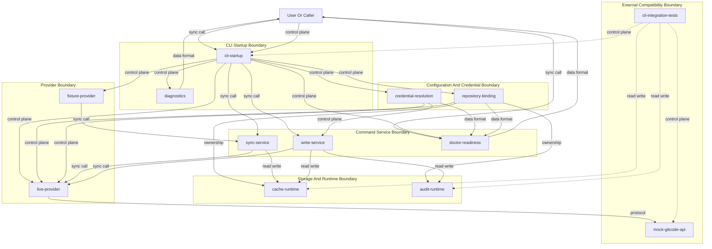

# Design Package Architecture

This file is copied from the approved Triborg design package during implementator preflight.

# Architecture

## Need
GitCode MCP live-readiness iteration 4 closes the provider-wiring gap by making explicit `--live` commands construct and use the live GitCode HTTP provider through the same CLI startup path operators use. The design keeps ordinary non-live behavior fixture-backed, proves live readiness with offline `httptest.Server` integration tests, and centralizes credential, repository binding, API base URL, cache, audit, and readiness reporting contracts. The architecture is intentionally narrow: it replaces fixture fallback on explicit live routes without broad rewrites or real network, real credentials, or OS Keychain dependency in primary validation.

- Make `gitcode-mcp sync --live` and `gitcode-mcp create-issue --live` reach the live provider startup route, not fixture-backed behavior.
- Provide typed missing-credential and live auth-failure diagnostics before or after HTTP access at the correct boundary.
- Share one credential resolution pipeline across auth status, doctor, sync, write checks, and live provider construction.
- Select one authoritative API base URL rule for live commands and make it visible in `doctor --live --format json`.
- Prove live sync and live create issue behavior offline using a mocked GitCode-compatible HTTP server.
- Preserve ordinary `gitcode-mcp sync` fixture-backed default behavior.
- Keep all fixtures and captured responses sanitized and public-safe.

- Real GitCode network end-to-end testing — outside primary acceptance because validation must run offline without credentials.
- OS Keychain integration as a primary test dependency — replaced by a mocked Keychain-equivalent credential source for acceptance.
- Broad provider, cache, CLI, or API rewrite — scope is provider-wiring gap closure.
- Prior design package archive modification — explicitly excluded by the formalized request.
- Diagram creation — deferred to the later architecture-diagram stage.
- Component-internal algorithms, concrete Go symbols, patch hunks, or line-level implementation steps — deferred to component-design and implementation stages.

## Approach
### Overview
The architecture introduces a narrow live startup contract around the real CLI entrypoint. CLI command parsing determines an effective provider mode: `offline-fixture` for default commands and `live-http` only when `--live` is explicit. In `live-http` mode, startup must construct the live GitCode HTTP provider, resolve credentials through the shared credential pipeline, bind the target repository and cache path, resolve the selected API base URL authority, and pass those effective values to sync, write, auth status, and doctor surfaces. This resolves the core defect class where `--live` could silently return fixture-shaped results., outcome-1 through outcome-10.

The live provider boundary is fail-closed. Missing usable credentials are reported as a typed missing-credential diagnostic before any live HTTP request is attempted. Invalid credentials are handled after the live provider sends a request and receives a 401 or 403 response, proving live provider reachability while preventing fixture success fallback. Fixture identifiers such as `ISSUE-42` and `WIKI-HOME` are treated as forbidden live-mode outputs in acceptance tests., Task 2, Task 4, Decommission Ledger.

Credential resolution is a shared top-level service contract, not command-local behavior. It supports environment token resolution and a test-injectable Keychain-equivalent source while preserving production credential semantics. The same resolved credential metadata is exposed to `doctor --live --format json` and consumed by sync/write gates and live provider construction so auth status cannot succeed while live write fails due to a different credential path., outcome-3, outcome-9; competitor reference `go-keyring` for separation of credential source and consumer.

Repository binding owns cache path, repository identity, audit destination, and the selected API base URL authority. This architecture selects repository binding `api_base_url` as the authoritative live API base URL for iteration 4. Non-authoritative alternatives, such as process-wide fallback environment values or default constants, may exist only as documented fallbacks when repository binding omits `api_base_url`; when repository binding provides `api_base_url`, live commands must use exactly that URL. This choice supports per-repository offline mock routing, deterministic tests, and explicit operator visibility.

Live sync and write operations reconcile mock GitCode API responses into existing cache and audit surfaces. Sync must fetch issues, wiki pages, and comments through the live provider and store sanitized mock records into the configured cache. Create issue must send an authenticated write request with idempotency behavior, record audit/cache confirmation, and never return fixture read-only errors in live mode., Task 6; competitor reference `gh-cli` for explicit command-mode network behavior and authenticated write confirmation.

The mocked GitCode API harness is an architecture-level validation subsystem. It uses `httptest.Server` and the real CLI startup path, not isolated provider unit tests, to prove routing, credential handling, request counts, cache/audit state, and doctor output. It replaces external dependencies only and does not mock the target app runtime, cache, audit, or CLI startup behavior.

### Architecture Diagram

### Components
- `cli-startup` — selects effective provider mode and composes live/offline command dependencies through the operator CLI path.
- `credential-resolution` — provides shared environment and injectable credential source resolution with typed missing-credential diagnostics.
- `repository-binding` — owns repository identity, cache/audit path binding, and authoritative `api_base_url` for live mode.
- `live-provider` — executes authenticated GitCode-compatible HTTP read/write operations and classifies auth/transport/API failures.
- `fixture-provider` — preserves existing non-live fixture-backed behavior only for default commands.
- `sync-service` — coordinates issue/wiki/comment sync and cache reconciliation for live and offline modes.
- `write-service` — coordinates live create issue, credential gate, idempotency behavior, audit, and cache confirmation.
- `cache-runtime` — stores and exposes inspectable issue, wiki, comment, and create-confirmation state.
- `audit-runtime` — stores inspectable non-secret write confirmations for live create issue.
- `doctor-readiness` — reports effective live mode, credential source, cache path, and API base URL as JSON.
- `diagnostics` — standardizes typed missing credential, live auth failure, transport, API, configuration, and fixture fallback diagnostics.
- `mock-gitcode-api` — provides offline GitCode-compatible HTTP behavior using sanitized payloads, request counters, and auth responses.
- `cli-integration-tests` — proves real CLI startup routing, cache/audit outcomes, and network isolation under `go test ./...`.

### Requirement Coverage
| Request Task | Architecture Resolution | Components | Interfaces / Flow | Risk | Validation |
|---|---|---|---|---|---|
| Task 1 | Explicit `--live` selects fail-closed `live-http` provider through real CLI startup and forbids fixture identifiers. | `cli-startup`, `live-provider`, `sync-service`, `mock-gitcode-api`, `cache-runtime` | CLI `sync --live` → credential/base URL/repository binding → live provider → mock API → cache | Existing command path may bypass startup composition. | Run real CLI command path against mock server; assert request count > 0 and no `ISSUE-42`/`WIKI-HOME`. |
| Task 2 | Credential resolver returns typed missing-credential before provider HTTP construction/use. | `credential-resolution`, `cli-startup`, `diagnostics`, `mock-gitcode-api` | CLI `sync --live` → credential resolver → `missing_credential` → exit | Credential check may occur too late. | Run `sync --live` with no env or mocked credential; assert typed diagnostic, failure status, zero mock requests. |
| Task 3 | Shared credential pipeline serves auth status, doctor, sync, write checks, and provider construction; test source emulates Keychain. | `credential-resolution`, `write-service`, `live-provider`, `doctor-readiness` | Mocked credential source → shared resolver → write gate → live create issue request | Auth status and write path could use divergent sources. | Run `create-issue --live` with `GITCODE_TOKEN` unset and mocked credential; assert authenticated mock request. |
| Task 4 | Invalid token is accepted as present credential, reaches live provider, then maps 401/403 to `live_auth_failure` without fixture fallback. | `live-provider`, `diagnostics`, `sync-service`, `mock-gitcode-api` | CLI `sync --live` → live HTTP request → mock 401/403 → live auth diagnostic | Auth failures may be normalized as generic error. | Assert mock request count > 0, auth failure visible, no fixture success. |
| Task 5 | Live sync reconciles mocked issue/wiki/comment responses into configured cache and blocks fixture leakage. | `sync-service`, `live-provider`, `cache-runtime`, `mock-gitcode-api` | Live provider list operations → sync service → cache runtime | Cache inspection may rely on source internals. | Run `sync --live`; inspect cache through runtime; assert mock records present and fixture ids absent. |
| Task 6 | Live create issue uses provider write route with idempotency, audit record, and cache confirmation. | `write-service`, `live-provider`, `audit-runtime`, `cache-runtime`, `mock-gitcode-api` | CLI create → credential/write gate → POST create → audit/cache confirmation | Existing fixture client may remain wired for writes. | Run `create-issue --live`; assert POST, idempotency behavior, audit/cache confirmation, no fixture read-only error. |
| Task 7 | Default `sync` remains `offline-fixture` and never constructs/calls live provider. | `cli-startup`, `fixture-provider`, `sync-service`, `mock-gitcode-api` | CLI `sync` → fixture provider → cache/offline output | Live config may accidentally affect default mode. | Run `sync` while mock server is available; assert success via offline behavior and zero mock requests. |
| Task 8 | Repository binding `api_base_url` is the authoritative live base URL when present; alternatives are ignored. | `repository-binding`, `cli-startup`, `live-provider`, `doctor-readiness`, `mock-gitcode-api` | Repository config → selected base URL → live provider requests | Existing env/default precedence may conflict. | Configure selected and non-selected endpoints; run `sync --live`; assert selected hit count and non-selected zero/failure. |
| Task 9 | `doctor --live --format json` reports effective live mode, credential source, cache path, and selected API base URL. | `doctor-readiness`, `credential-resolution`, `repository-binding`, `cli-startup` | CLI doctor → startup resolution snapshot → JSON report | Doctor may report configured rather than effective values. | Run doctor with temp cache/base URL/mocked credential; assert JSON fields match effective runtime. |
| Task 10 | Offline integration harness uses `httptest.Server` and real CLI command paths for sync/create/doctor under `go test ./...`. | `mock-gitcode-api`, `cli-integration-tests`, `cache-runtime`, `audit-runtime` | Test harness → real CLI startup → mock API/temp cache/audit → assertions | Tests may become provider unit tests instead of startup tests. | Run `go test ./...`; assert no real credentials, external network, or OS Keychain access. |

### Risks And Validation
- Existing CLI tests may exercise a helper path rather than the operator startup path — mitigation: require integration tests to enter through the real CLI entrypoint or equivalent test binary wrapper — severity: high.
- Credential sources may diverge between auth status and write/sync paths — mitigation: one shared credential resolution contract with doctor exposing non-secret source metadata — severity: high.
- Live mode may retain hidden fixture fallback — mitigation: fail-closed admission rules and acceptance assertions rejecting `ISSUE-42`, `WIKI-HOME`, and `fixture client is read-only` — severity: high.
- API base URL precedence may conflict with existing environment/default behavior — mitigation: document repository binding `api_base_url` as authoritative when present and prove selected/non-selected routing by mock hit counts — severity: medium.
- Cache/audit inspection may depend on internal details — mitigation: validate through target runtime surfaces rather than source-level claims — severity: medium.
- Mock API may drift from live GitCode shapes — mitigation: keep minimal sanitized compatibility payloads and confine them to adapter-level acceptance needs — severity: medium.
- Doctor may leak secret material — mitigation: report credential source and readiness only, never token values — severity: high.
- Offline default behavior may change unintentionally — mitigation: explicit default sync test with available mock server and zero HTTP requests — severity: medium.

- CLI live sync success — trigger `gitcode-mcp sync --live` with valid mocked credential and repository `api_base_url`; product surface is sync command and cache runtime; expected outcome is mock server requests, mock issue/wiki/comment cache records, and absence of `ISSUE-42`/`WIKI-HOME`; proves live provider wiring and cache population.
- CLI missing credential — trigger `gitcode-mcp sync --live` with no environment token and no mocked credential; product surface is sync command diagnostics; expected outcome is typed missing-credential failure and zero mock requests; proves pre-HTTP credential gate.
- CLI mocked credential write — trigger `gitcode-mcp create-issue --live` with `GITCODE_TOKEN` unset and mocked Keychain-equivalent credential source; product surface is create issue command, mock API, audit, and cache; expected outcome is authenticated create request plus audit/cache confirmation; proves shared credential injection.
- CLI invalid token — trigger `gitcode-mcp sync --live` with invalid token and mock 401/403; product surface is sync command diagnostics; expected outcome is live auth failure and request count greater than zero; proves live provider reached and no fixture fallback.
- CLI offline default sync — trigger `gitcode-mcp sync` while mock server is available; product surface is sync command; expected outcome is existing fixture-backed behavior and zero mock requests; proves default behavior remains offline.
- API base URL authority — trigger `gitcode-mcp sync --live` with repository binding pointing to selected mock server and non-authoritative alternative configured to another endpoint; product surface is live HTTP routing; expected outcome is selected server hit count greater than zero and non-selected endpoint zero/failure; proves base URL rule.
- Doctor live JSON — trigger `gitcode-mcp doctor --live --format json` with temporary cache path, repository `api_base_url`, and mocked credential source; product surface is doctor command; expected outcome is JSON provider mode `live-http`, credential source metadata, cache path, and API base URL; proves readiness reporting.
- Full offline test suite — trigger `go test ./...`; product surface is local Go test runtime; expected outcome is all offline CLI live integration tests pass without real credentials, external network, or OS Keychain; proves iteration acceptance.

## Benefits
- Reduces operator ambiguity by making `--live` report and use an explicit `live-http` provider mode.
- Enables full `go test ./...` validation without real credentials, external network, or OS Keychain.
- Prevents false live-readiness signals by failing tests on known fixture identifiers and fixture read-only errors.
- Improves supportability by exposing provider mode, credential source, cache path, and API base URL in JSON doctor output.
- Preserves existing offline development behavior by keeping default `sync` fixture-backed and network-free.

## Competition / Alternatives
- `gh-cli` - GitHub CLI behavior supports the principle that explicit authenticated network commands should fail visibly on auth/config errors rather than silently using offline fixtures. The proposed design applies that clarity to GitCode MCP while preserving an explicit offline default path.
- `go-keyring` - go-keyring demonstrates separating credential storage/source concerns from command consumers. The proposed design uses a shared credential resolution contract and a mocked Keychain-equivalent source so tests prove credential propagation without relying on OS Keychain.
- `mcp` - MCP tool integrations benefit from deterministic, inspectable local behavior because agents need reliable command outputs and state. The proposed cache-first live-readiness design keeps local cache/audit verification deterministic while proving live provider wiring through a mock server.
