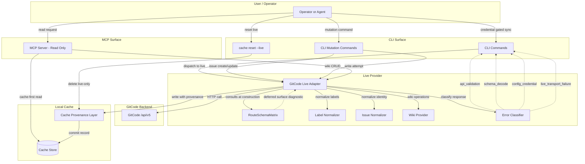

# Design Package Architecture

This file is copied from the approved Triborg design package during implementator preflight.

# Architecture

## Need
Iteration 5 upgrades the live GitCode provider from "issue paths reached the real service" into a credible, evidence-led live surface. It closes API-shape gaps discovered in polygon smoke: label modeling, issue identity normalization, wiki-as-repository strategy, error taxonomy redesign, cache provenance/isolation, and MCP write-exposure decisions. Every surface is either implemented through documented or live-probed `/api/v5` routes with mocking-provable adapters, or explicitly deferred with classifier diagnostics that cannot silently succeed.

- Establish a live route/schema coverage contract for Issues, Labels, Milestones, Pull Requests, Comments, and Wiki with evidence-class provenance (OpenAPI, live probe, deferred).
- Normalize GitCode issue identity shapes (numeric `id`, string `number`) into stable cache/source identifiers.
- Model GitCode label create/update payloads as JSON-string label lists, parse returned label objects, and replace the old add-label route and array-payload assumptions.
- Decide milestone coverage: implement via documented `/api/v5` surfaces or defer with explicit diagnostics.
- Decide PR/comment coverage: implement via documented `/api/v5` surfaces or defer with explicit diagnostics.
- Select wiki strategy: prefer token-compatible `/api/v5/repos/{owner}/{repo}.wiki/contents|raw`, keep browser `web-api` routes out of default product execution.
- Redesign error classification so 400/schema/decode failures are distinct from transport/configuration failures.
- Specify cache provenance or live-cache reset/isolation so fixture records cannot masquerade as live data.
- Decide MCP write exposure: implement with tested idempotent mutation or keep MCP read-only with CLI as mutation surface.
- Ensure `go test ./...` and `git diff --check` pass without real credentials, network, SSH agent, or OS Keychain.

- Broad cache schema rewrite — iteration 5 works within schema version 7 unless a provenance field is needed, and then adds only a lightweight migration.
- Making live network tests mandatory — live smoke is credential-gated and optional.
- Storing raw API responses, cookies, tokens, private coordinates, or unsanitized browser captures.
- Requiring SSH keys for default MCP wiki operation — wiki-git is an optional separate provider path.
- Replacing the cache-first read model.
- Extending mocked GitHub-like assumptions — every shape decision must cite documented GitCode OpenAPI or sanitized live probes.

## Approach
### Overview
The architecture extends the existing provider selection model (fixture/live/unavailable) with a new `RouteSchemaMatrix` contract that governs which GitCode surfaces are supported, deferred, or blocked per product area. No provider wiring is replaced — iteration 5 adds adapter models, response normalizers, and error classifiers behind the same `live` provider and `--live` CLI gate from iteration 4.

### Core Invariants

1. **Evidence-led shape contract.** Every adapter model decision cites a documented GitCode OpenAPI page or a sanitized live probe recorded in `project/research/gitcode-wiki-api-v5-repository-model-2026-06-23.md`. GitHub-shaped assumptions are not extended without evidence.

2. **Provider isolation.** The `live` provider owns live adapter routes, models, and error classification. The `fixture` provider is unaffected. The `RouteSchemaMatrix` is a configuration artifact consumed by the live provider, not a runtime dispatch tree.

3. **Cache provenance.** Every cache record (issue, label, wiki page) gains a `provenance` field (`fixture` or `live`) recorded at sync time. A `cache reset --live` command clears live-origin records from the cache without touching fixture records. Sync commands refuse to write live-origin records when the provider mode is `fixture`.

4. **Error taxonomy.** The live HTTP response path produces exactly four top-level error classes: `api_validation` (4xx responses from GitCode, including 400, 401, 403), `schema_decode` (malformed JSON, unexpected response shape, missing required fields), `config_credential` (missing token, wrong binding, expired credential), and `live_transport_failure` (DNS, TCP, TLS, timeout, context cancellation). These classes are tested with mocked responses at each failure boundary. A 400, a malformed JSON body, a schema mismatch, and a network timeout all trigger distinct diagnostics and distinct error types in the repo's error taxonomy (`internal/errors/`).

5. **Label contract.** Labels flow as JSON strings on create/update payloads (`"labels": '["bug","enhancement"]'`) and return as objects (`{"id":..., "name":..., "color":..., "created_at":..., "updated_at":...}`). The live adapter normalizes response label objects into cache `SourceLabel` records. The old `/api/v5/repos/{owner}/{repo}/issues/{number}/labels` add-label route and any GitHub-like `[]string` array payload are decommissioned: tests must fail if they are used.

6. **Wiki-as-repository.** Wiki read/list/sync uses `/api/v5/repos/{owner}/{repo}.wiki/contents`, `/contents/{path}`, and `/raw/{path}`. Write (create/update/delete) uses `POST/PUT/DELETE /contents/{path}` with base64-encoded content and `sha`-based update/delete semantics. Browser `web-api.gitcode.com/api/v2/projects/wiki/*` routes are kept as discovery research but not wired into default product execution.

7. **MCP write exposure.** MCP is read/cache-oriented by default in this iteration. CLI remains the supported mutation surface for issue create/update/label and wiki writes. MCP read tools (get, search, list) work against cached records. If MCP writes are implemented, they use the same idempotent mutation paths as CLI writes and are tested independently.

### Components and Responsibilities

| Component | Architectural Role |
|---|---|
| `RouteSchemaMatrix` (new) | A static configuration artifact that declares per-product-area support status (`supported`, `deferred`, `unsupported`), route family (`/api/v5`), evidence class (`OpenAPI`, `live_probe`, `deferred`), and diagnostic message for deferred/unsupported surfaces. Consumed by the live adapter at construction time. |
| `GitCode live adapter` (extended) | Adds issue normalization, label model conversion, wiki-as-repository CRUD, milestone adapter (implemented or deferred), PR/comment adapter (implemented or deferred), and error-class routing on HTTP responses. |
| `Label normalizer` (new) | Converts GitCode response label objects into cache `SourceLabel` records; validates required fields; produces `schema_decode` diagnostics on malformed label responses. |
| `Issue normalizer` (extended) | Tolerates numeric `id` and string `number`; normalizes both into stable cache identity; produces `schema_decode` on malformed identity fields. |
| `Wiki provider` (new) | Implements directory traversal, path encoding, base64 decode/encode, raw reads, create/update/delete with `sha` semantics, and error handling on `/api/v5/repos/{owner}/{repo}.wiki`. |
| `Error classifier` (new) | Maps HTTP status codes, response body parse results, and network errors into the four-class taxonomy. |
| `Cache provenance layer` (extended) | Adds `provenance` column to `records` (and any child tables) with values `fixture` or `live`. Provides `cache reset --live` CLI command. Sync writes provenance at record-commit time. |
| `MCP server` (extended) | Exposes read tools against cached records; write tools either present with idempotent mutation or absent with `unsupported_capability` diagnostic. |
| `CLI mutation commands` (extended) | Issue create/update use string-label payloads; wiki create/update/delete use `/api/v5/repos/{owner}/{repo}.wiki/contents/{path}` with base64 content. |
| `Offline test fixtures` (new/extended) | Mocked `httptest.Server` routes for each implemented or deferred surface; assertion helpers for error classes and label shapes. |

### Data Flow

```
Operator/Agent
      │
      ├─ CLI `--live` ──→ live adapter ──→ GitCode /api/v5 ──→ error classifier
      │                        │                    │
      │                        └─→ label/issue/wiki normalizer ──→ cache (with provenance)
      │
      ├─ MCP read ──→ cache (cache-first read)
      │
      └─ `cache reset --live` ──→ deletes live-provenance records
```

### Architecture Diagram


### Components
- `RouteSchemaMatrix` — Declares per-product-area coverage contract
- `live_adapter` (GitCode live adapter) — Owns live HTTP client, route dispatch, issue/label/milestone/wiki CRUD, PR/comment deferral
- `label_normalizer` — Converts GitCode label objects to cache SourceLabel; validates required fields
- `issue_normalizer` — Tolerates numeric id and string number; normalizes to cache identity
- `wiki_provider` — Implements `/api/v5/repos/{owner}/{repo}.wiki` CRUD with base64 and sha
- `error_classifier` — Maps HTTP responses to four-class taxonomy
- `cache_provenance_layer` — Provenance column, reset command, sync integration
- `mcp_server` — Read tools exposed; write tools absent
- `cli_mutation_commands` — String-label create/update, wiki CRUD commands
- `test_suite` — Mocked tests, e2e gating

### Requirement Coverage
| Request Task | Architecture Resolution | Components | Interfaces / Flow | Risk | Validation |
|---|---|---|---|---|---|
| Task 1 | RouteSchemaMatrix artifact declares support status per product area with evidence class; live adapter reads matrix at construction | RouteSchemaMatrix, live adapter | Adapter consults matrix before dispatching any route; unsupported routes return typed diagnostics | Matrix becomes stale if GitCode API changes | `go test ./...` runs adapter-level tests for each surface showing either parsed GitCode-shaped responses or `unsupported_capability` diagnostic |
| Task 2 | Issue normalizer accepts numeric `id` and string `number`; normalizes both to cache `remote_id` and `source_id`; malformed identity → `schema_decode` | Issue normalizer, live adapter | `GET /api/v5/repos/{owner}/{repo}/issues` → normalizer → cache write | GitCode might change identity field types in future API versions | Mocked live issue read tests with both numeric `id` and string `number` payloads; malformed identity payloads trigger `schema_decode` diagnostic in test assertions |
| Task 3 | Label payloads use JSON-string encoding; returned label objects normalized to `SourceLabel`; old `/issues/{number}/labels` route replaced; array payload assumption decommissioned | Label normalizer, live adapter, CLI issue commands | CLI → adapter → `POST /issues` with string labels; response → normalizer → `SourceLabel` in cache | GitCode may accept labels in multiple formats; must test both positive and negative cases | Stubbed CLI tests: create/update issue with labels as JSON string succeeds; tests with JSON array labels fail; old add-label route absent from execution |
| Task 4 | Milestones implemented via documented `/api/v5/repos/{owner}/{repo}/milestones` OpenAPI routes; parsed into cache milestone records | Live adapter (milestone methods), cache | `sync --live --repo X --milestones` → `GET /milestones`, `GET /milestones/{id}` → cache | Undocumented response fields may cause partial parse failures | Mocked GET milestone responses parsed and cached; MCP/CLI milestone read returns cache data; schema mismatch responses produce `schema_decode` not silent success |
| Task 5 | PRs and comments deferred with explicit diagnostics; `unsupported_capability` type returned for PR/comment read attempts | RouteSchemaMatrix, live adapter, CLI/MCP | Any PR/comment read → matrix check → `unsupported_capability` diagnostic | Deferral must not silently return empty results | Tests trigger PR/comment reads against mocked server; response is `unsupported_capability` not empty cache, not transport failure, not silent success |
| Task 6 | Wiki uses `/api/v5/repos/{owner}/{repo}.wiki/contents|raw` for read/list/sync; create/update/delete on `/contents/{path}` with base64 content and `sha`; browser `web-api` routes kept internal | Wiki provider (live), live adapter, CLI/MCP wiki commands | `sync --live --wiki` → directory traversal → raw reads → cache; `create-wiki-page --live` → base64-encode → POST `/contents/{path}` | Path encoding edge cases with special characters; sha resolution race on concurrent edits | Mocked wiki tests: directory listing, raw read, base64 create/update/delete, sha-based update/delete, 404 handling; browser web-api routes not called in default tests |
| Task 7 | Four-class error taxonomy: `api_validation`, `schema_decode`, `config_credential`, `live_transport_failure`; error classifier maps HTTP results to classes | Error classifier, live adapter, CLI/MCP error reporting | HTTP response → classifier → typed error → CLI stderr / MCP error response | Ambiguous boundary between api_validation and schema_decode (e.g., 200 with wrong shape) | Mocked 400, malformed JSON, schema mismatch, credential 401, and network timeout each produce distinct error types; regression tests assert 400 ≠ transport failure |
| Task 8 | `provenance` column on `records`; `cache reset --live` CLI command; sync writes provenance at record commit; fixture-to-live transition deterministic | Cache provenance layer, CLI cache commands, sync service | `sync` writes `provenance=fixture` or `provenance=live`; `cache reset --live` deletes live-origin records; get/list expose provenance in output | Schema migration from v7 to v8 must preserve existing data | Tests: fixture sync creates fixture-provenance records; live sync creates live-provenance records; reset clears live but not fixture; transition tests verify fixture records never become live-provenance without explicit sync |
| Task 9 | MCP remains read/cache-oriented; write tools absent from MCP tool registry in this iteration; CLI mutation commands are the supported write surface | MCP server, CLI mutation commands | MCP tool list excludes create/update/write tools; MCP write attempt returns `unsupported_capability` | If MCP clients need write access before next iteration, this is a deferred feature request | MCP tool advertisement tests show read tools present, write tools absent; MCP write attempts produce `unsupported_capability` diagnostic; CLI mutation tests still pass independently |
| Task 10 | `go test ./...` and `git diff --check` run without credentials, network, SSH agent, or Keychain; optional live smoke gated behind `--live` and redacted output; E2E tag for credential-gated tests | Test suite, CI configuration | `go test ./...` → all packages pass with mocked servers only; `go test -tags=e2e ./internal/e2e/` → credential-gated live smoke | New test dependencies might accidentally import network-requiring libraries | `go test ./...` passes; `git diff --check` passes; live smoke skip when no credentials; redacted smoke output |

### Risks And Validation
- GitCode `/api/v5` routes may change without notice — mitigation: RouteSchemaMatrix is a single configuration point; unsupported surfaces immediately return diagnostics rather than silently breaking — severity: medium
- Wiki path encoding edge cases (spaces, unicode, special characters) — mitigation: Mocked tests cover known encoding patterns from smoke evidence; adapter logs path-encoding failures as `api_validation` — severity: low
- Concurrent sha-based wiki edits produce 409 conflicts — mitigation: Adapter reports 409 as `api_validation` with current sha retry information; CLI exposes explicit `--sha` flag for conflict-aware writes — severity: low
- Schema migration v7→v8 on large caches — mitigation: Migration is a single `ALTER TABLE ADD COLUMN`; backup created before migration per existing policy (docs/cache-and-sync-model.md §Cache Migration) — severity: low
- Browser web-api routes may become token-compatible later — mitigation: Keep route discovery notes in `project/research/` but do not wire into product execution without explicit re-validation and product decision — severity: low

## Benefits
- Operators and agents can sync, read, create, and update issues from the cache with GitCode-correct label encoding, normalized identities, and clear error diagnostics no longer confused with network outages.
- Wiki pages are readable and syncable through the same token model as repository issues, eliminating the need for browser-session credentials.
- Cache provenance ensures fixture data and live data are never confused in the same namespace, and `cache reset --live` provides deterministic recovery.
- MCP clients get read access to synced cache data; customers who prefer CLI mutation have explicit escape hatches without MCP write risk.
- Offline test suite (`go test ./...`) passes without any external services, browser cookies, or exposed tokens, maintaining the project's public-safe contract.

## Competition / Alternatives
- `gh-cli` (GitHub CLI) — Requires GitHub.com network access for most operations; does not provide offline cache or GitCode API compatibility. Our approach is superior for GitCode users because it works cache-first with poor network availability, tolerates GitCode-specific API shapes, and keeps credentials out of test fixtures.
