# Design Package Architecture

This file is copied from the approved Triborg design package during implementator preflight.

# Architecture

## Need
This version defines a fault-minimal MCP server architecture that never drops all tools from `tools/list` when cache/service initialization fails, introduces a name-based tool registry, adds bounded collection sync with cancellation and progress, unifies credential resolution across read/write/auth paths, fixes wiki path normalization and write confirmation, designs PR read/comment routes with distinct cache kinds, and replaces opaque `internal_error` for lock contention with typed `cache_busy` diagnostics while keeping concurrent readers unblocked.

- Deliver MCP lifecycle/control-plane tools (`repo_status`, `sync_live`, `index_repo`, `auth_status`, `doctor`) with write tools returning `unsupported_capability` via a name-based tool registry.
- Guarantee MCP server startup even when cache/service init fails, surfacing diagnostics through `tools/list` capability metadata and `doctor` tool results.
- Bounded collection sync with context cancellation, progress events, `PartialSyncError` retryable diagnostics, and internal bounded wiki tree traversal.
- Empty wiki bootstrap with typed `empty_wiki` diagnostic and optional POST-based initialization.
- Wiki path normalization (`wiki/Home.md` not `wiki/Home.md.md`) and write confirmation via follow-up GET verification.
- Unified `CredentialResolver` pipeline shared by `auth status`, read probes, and all write commands.
- Issue create/update label omission and `add-comment` response decoding with `http_attempted` and `schema_decode` classification.
- PR read/comment routes with `kind: pull_request` and `kind: pr_comment` cache projection, excluding deployment-inhibited routes.
- Lock contention diagnosed as typed `cache_busy`; concurrent readers unblocked by writer lock.

- MCP write tools (create/update issue, add-comment, wiki create/update page) — explicitly unsupported in iteration 6, returning `unsupported_capability`.
- PR merge, review, or deployment-inhibited routes (`pull_requests`, `merge_requests`, `review_comments`) — excluded from adapter routes.
- Browser-session cookies or browser-derived tokens in credential resolution — out of scope.
- Writing the structured diagram — delegated to `architecture-diagram` stage.
- Component-internal implementation detail — delegated to `component-design` stage.
- CL-specific patch hunks, line-level edits, or imperative code-change steps — excluded.

## Approach
### Overview
The architecture organizes around five layers with new fault-isolation boundaries:

**Layer 1: MCP Transport & Lifecycle Surface** (`internal/mcp/`)
- The MCP server construction path splits into two branches: (a) a healthy path that builds a full `Service`-backed server, and (b) a minimal fallback path when cache init, schema validation, or `Service` construction fails.
- The minimal server carries a `StartupDiagnostic` struct (error class, message, remediation text) and injects it into every `tools/list` response via server capability metadata and into the `doctor` tool result.
- The tool registry migrates from a positional slice `[]MCPTool` to a `map[string]MCPTool` keyed by tool name. `tools/call` resolves handlers by name lookup, not positional index. Adding a lifecycle tool adds a map entry without shifting other handler mappings.
- Lifecycle tools: `repo_status` returns binding state; `sync_live` accepts collection selectors (`--issues`, `--wiki`, `--comments`, `--pulls`) and returns sync events with counts; `index_repo` invokes `Service.Index`; `auth_status` returns credential presence/source; `doctor` returns structured diagnostics including startup-failure when present.
- Known write tool names (`create_issue`, `update_issue`, `add_comment`, `create_page`, `update_page`) map to a shared `unsupportedCapabilityHandler` that returns the structured error without credential lookup or HTTP calls.

**Layer 2: Sync Service** (`internal/service/`)
- Every collection sync path accepts a context and a `SyncBounds` struct (max pages, max records, progress channel).
- Each page fetch checks `ctx.Done()` before making the outbound request. On cancellation or deadline, the sync commits records fetched so far and returns `PartialSyncError` with `success_count`, `total_requested`, and typed `Diagnostic` (e.g., `sync_cancelled`, `sync_timeout`).
- Progress events carry `collection`, `page`, `records_fetched`, and `last_seen_cursor` fields emitted after each page commit.
- Wiki sync delegates to an internal `ListWikiPages` that uses a stack-based traversal with cancellation check at each directory level. No outer loop wrapper.

**Layer 3: GitCode Live Adapter** (`internal/gitcode/`)
- Wiki adapter: `ListWikiPages` uses internal bounded/stacked traversal checking context and emitting per-page progress; empty wiki detection maps `GET /api/v5/repos/{owner}/{repo}.wiki/contents` 400/404 to `empty_wiki` diagnostic.
- Wiki write: `create-page` POSTs to `/api/v5/repos/{owner}/{repo}.wiki/contents/{path}`; on 201 with missing `path`/`sha`, performs follow-up `GET contents/{path}` to confirm.
- Issue adapter: serialization omits `"labels"` key from JSON body when no label mutation requested (`omitempty` plus conditional exclusion).
- Comment adapter: `add-comment` decodes the live `{id, note_id, body, created_at, user}` response shape; sets `http_attempted: true` when provider was contacted; on decode failure, returns `schema_decode` diagnostic with `http_attempted: true`.
- PR adapter (new): `ListPRs` → `GET /api/v5/repos/{owner}/{repo}/pulls`; `GetPR` → `GET /pulls/{number}`; `ListPRComments` → `GET /pulls/{number}/comments`; `AddPRComment` → `POST /pulls/{number}/comments`. PR records cached as `kind: pull_request` with `source_id` derived from `number`. PR comments cached as `kind: pr_comment` linked by `discussion_id` or PR number. Deployment-inhibited routes excluded from route table.

**Layer 4: Cache Layer** (`internal/cache/`)
- Lock strategy uses SQLite WAL mode with a shared read lock and an exclusive write lock. Read-only paths (search, list) acquire shared read locks; write paths (sync commits, index writes) acquire an exclusive write lock.
- When the exclusive lock is held, other writers receive a typed `cache_busy` diagnostic (retryable), not `internal_error`. Concurrent readers holding shared locks are not blocked by the exclusive write lock.
- Schema version check on open compares cache schema version against the binary-supported schema version (11). Mismatch above binary version produces `schema_incompatible` diagnostic.

**Layer 5: Credential Resolver** (`internal/auth/`)
- A shared `CredentialResolver` struct is constructed once per invocation and passed to all command paths.
- Resolution order: env var `GITCODE_TOKEN` → env var `GITCODE_USER`/`GITCODE_PASS` → OS keychain (GitCode hostname) → none. The same priority order applies to `auth status`, read probes, and write commands.
- Commands that require credentials invoke `resolver.Resolve()` once; the result is threaded to the HTTP client as a bearer token or basic auth header.

**Cross-cutting**: All MCP tools, CLI commands, and sync paths share the same `CredentialResolver` and `Service` (or minimal `DoctorService`) instance. The `DoctorService` provides `doctor` and the startup diagnostic without requiring a fully initialized cache.

### Architecture Diagram

```mermaid
flowchart TD
    subgraph External
        Agent[MCP Client / Agent]
        GitCodeAPI[GitCode Live API]
    end

    subgraph Runtime
        subgraph Layer1 [internal/mcp]
            MCPLifecycle[MCP Lifecycle Surface]
            ToolReg[Name-Based Tool Registry]
            StartupDiag[Startup Diagnostic]
            UnsupHandler[Unsupported Capability Handler]
        end

        subgraph Layer2 [internal/service]
            SyncSvc[Bounded Sync Service]
            DoctorSvc[Doctor Service]
        end

        subgraph Layer3 [internal/gitcode]
            WikiAdapter[Wiki Adapter]
            IssueAdapter[Issue Adapter]
            CommentAdapter[Comment Adapter]
            PRAdapter[PR Adapter]
        end

        subgraph Layer4 [internal/cache]
            CacheStore[Cache Store WAL Mode]
        end

        subgraph Layer5 [internal/auth]
            CredResolver[Credential Resolver]
        end
    end

    Agent -->|tools/list tools/call| MCPLifecycle
    MCPLifecycle -->|name lookup| ToolReg
    MCPLifecycle -->|injects diagnostic| StartupDiag
    ToolReg -->|write tools map to| UnsupHandler
    ToolReg -->|lifecycle tools dispatch to| SyncSvc
    ToolReg -->|lifecycle tools dispatch to| DoctorSvc

    SyncSvc -->|bounded sync with context| WikiAdapter
    SyncSvc -->|bounded sync with context| IssueAdapter
    SyncSvc -->|bounded sync with context| CommentAdapter
    SyncSvc -->|bounded sync with context| PRAdapter
    SyncSvc -->|progress events| Agent

    WikiAdapter -->|GET POST wiki contents| GitCodeAPI
    IssueAdapter -->|GET POST PATCH issues| GitCodeAPI
    CommentAdapter -->|GET POST comments| GitCodeAPI
    PRAdapter -->|GET POST pulls/comments| GitCodeAPI

    WikiAdapter -->|read write records| CacheStore
    IssueAdapter -->|read write records| CacheStore
    CommentAdapter -->|read write records| CacheStore
    PRAdapter -->|read write records| CacheStore

    SyncSvc -->|read write records| CacheStore
    DoctorSvc -->|schema check lock check| CacheStore

    MCPLifecycle -->|credential gated| CredResolver
    SyncSvc -->|credential gated| CredResolver
    WikiAdapter -->|credential gated| CredResolver
    IssueAdapter -->|credential gated| CredResolver
    CommentAdapter -->|credential gated| CredResolver
    PRAdapter -->|credential gated| CredResolver

    CredResolver -->|env var keychain| External
    Agent -->|sync request| SyncSvc
    SyncSvc -->|PartialSyncError cache_busy empty_wiki| Agent
    MCPLifecycle -->|startup diagnostic in capability| Agent
    UnsupHandler -->|unsupported_capability| Agent
```

### Components
- `internal/mcp` — MCP server construction with minimal fallback path; name-based tool registry; lifecycle tools; unsupported_capability handler; startup diagnostic injection
- `internal/service` — Bounded sync with SyncBounds/context cancellation/PartialSyncError; progress events; empty wiki routing; index_repo delegation
- `internal/gitcode` — Wiki empty detection/bootstrap; wiki path normalization; bounded tree traversal; issue label omission; add-comment decoding; PR routes with deployment-inhibited exclusion
- `internal/cache` — SQLite WAL mode; shared/exclusive lock separation; schema version check; typed cache_busy diagnostic
- `internal/auth` — Shared CredentialResolver with env var > basic auth > keychain priority; deterministic resolution

### Requirement Coverage
| Request Task | Architecture Resolution | Components | Interfaces / Flow | Risk | Validation |
|---|---|---|---|---|---|
| Task 1 | Name-based tool registry; lifecycle tools defined; `unsupported_capability` handler for known writes; `index_repo` routes to `Service.Index` | `internal/mcp/`, `internal/service/` | `tools/list` returns named tools; `tools/call` resolves by map key; `index_repo` handler calls `Service.Index()` | Registry migration may break existing tool indexing in tests | MCP client tests: `tools/list` returns lifecycle names; `repo_status` returns nothing bound on empty cache; `sync_live --issues` returns sync event; `index_repo` invokes `Service.Index` (observed by index outcome); `create_issue` call returns `unsupported_capability` without credential lookup or HTTP call; new tool addition test proves name-based handler resolution |
| Task 2 | Minimal MCP server construction when cache/Service init fails; `StartupDiagnostic` injected into `tools/list` capability block and `doctor` result | `internal/mcp/` | `Server.New()` returns server even on init failure; `tools/list` always includes `doctor`; capability metadata carries diagnostic class | Diagnostic metadata format must be compatible with MCP spec capability block | MCP tests: read-only cache path → `tools/list` returns doctor + `cache_path_unwritable`; schema version > 11 → `schema_incompatible`; writer-locked cache → `cache_lock_contention`; injected cache init failure → minimal server starts, `tools/list` returns doctor, `doctor` call returns startup-failure diagnostic with actionable text |
| Task 3 | Bounded `SyncBounds` with max pages/records; context cancellation checked per page; `PartialSyncError` with retryable diagnostic; wiki internal stack-based bounded traversal with cancellation | `internal/service/`, `internal/gitcode/` | Service passes context+SyncBounds to adapter; adapter checks `ctx.Done()` per page; wiki `ListWikiPages` uses internal stack with cancellation at each level | Paginated providers may return variable page sizes; bounding must still honor page boundaries | Issues: 50 records, page size 10, cancel before page 4 → `PartialSyncError` with success_count=30, `sync_cancelled`; `--timeout 2s` → `sync_timeout`; progress channel ≥1 event per page; wiki: recursive tree, cancel mid-traversal → stops within level, returns `PartialSyncError` with committed records |
| Task 4 | Empty wiki detection on 400/404 from `GET …/wiki/contents` returns `empty_wiki` diagnostic with remediation text; `create-page --live` attempts POST `Home.md` bootstrap or returns `unsupported_wiki_uninitialized` | `internal/gitcode/`, `internal/service/` | Adapter maps 400/404 to typed empty wiki error; service surfaces as diagnostic; `create-page` POSTs bootstrap page or short-circuits | Provider may return 400 for reasons other than uninitialized wiki; differentiation logic needed | Mock: 400/404 wiki contents → `empty_wiki` diagnostic class with actionable text; `create-page` against empty-wiki provider → either POST 201 + confirm GET, or `unsupported_wiki_uninitialized` |
| Task 5 | Wiki path normalization stores prefix `wiki/` + remote basename; `create-page` POST response checked for path/sha; if absent, follow-up GET `contents/{path}` confirms; on confirmation, record cached with `http_attempted: true` | `internal/gitcode/`, `internal/cache/` | Adapter strips extension duplication; service performs confirm-GET when POST body lacks path/sha; cache stores normalized path | Embedded paths (subdirectories) may need additional normalization rules | Mock: remote `Home.md` → cached path `wiki/Home.md`; `create-page` POST 201 missing path/sha → follow-up GET confirms → cached with `http_attempted: true`; confirm GET fails → `write_confirmation_incomplete` diagnostic |
| Task 6 | Shared `CredentialResolver` with env var / keychain priority; resolver invoked once per command; result threaded to HTTP client as bearer token or basic auth | `internal/auth/`, `cmd/gitcode-mcp/` | `CredentialResolver.Resolve()` returns `Credential`; `auth status` reads resolver; write commands call resolver then pass credential to adapter HTTP client | Keychain integration may not be available on all platforms; graceful fallback needed | Mock: `GITCODE_TOKEN` env var → `auth status` reports present, `add-comment --live` includes bearer token; no credential → `auth status` reports `credential_unavailable`, `create-issue --live` fails with `credential_unavailable` before HTTP call; multi-source (env+keychain) → same source picked for both `auth status` and write command |
| Task 7 | Issue create/update serialization excludes `labels` key when no label mutation (omitempty + conditional); `add-comment` decodes `{id, note_id, body, created_at, user}` into struct; `http_attempted` set on provider contact; decode failure → `schema_decode` diagnostic | `internal/gitcode/` | JSON serialization drops `labels` field; comment decoder maps live fields; error classification sets `http_attempted` before returning | The `omitempty` tag alone may not suffice if `labels` is a non-nil empty slice; conditional exclusion or `nil` guard needed | Mock: issue create without labels → HTTP body lacks `labels` key; issue update title-only → no `labels` key; `add-comment` live response → decoded with `http_attempted: true` and cached; malformed body → `http_attempted: true` + `schema_decode` diagnostic |
| Task 8 | New PR adapter with routes: list, detail, comments (read+write); cache projection: `kind: pull_request` with `number`-derived `source_id`, `kind: pr_comment` linked by `discussion_id`; deployment-inhibited routes excluded from route table | `internal/gitcode/`, `internal/cache/` | Adapter implements `ListPRs`, `GetPR`, `ListPRComments`, `AddPRComment`; cache writer stores PR and PR comment records; route matrix excludes `pull_requests`, `merge_requests`, `review_comments` | PR schema may differ from documented fixtures; fixture-based testing required | Mock: PR list → `GET /pulls` caches `kind: pull_request` with fields `id,number,html_url,state,title,body,user,labels,base,head`; PR detail → `GET /pulls/{number}` returns cached record; PR comments → `GET /pulls/{number}/comments` caches `kind: pr_comment` linked to parent; PR comment write → `POST` 201 `{id,note_id,body}` cached with `http_attempted: true`; route exclusion → zero calls to deployment-inhibited routes |
| Task 9 | SQLite WAL mode with shared read lock + exclusive write lock; readers acquire shared lock; writers acquire exclusive lock; writer contention → `cache_busy` diagnostic; readers not blocked by exclusive writer hold | `internal/cache/` | Cache store/open configures WAL; read paths use shared lock; write paths use exclusive lock; lock acquisition failure returns typed `cache_busy` error | WAL mode behavior may vary across SQLite versions and OS filesystem semantics | Runtime test (no mocks): two concurrent `search_sources` → both complete without `internal_error`; writer hold + concurrent readers → readers complete; two concurrent writers → one returns `cache_busy` not `internal_error`; three goroutines (2 readers + 1 writer) → readers complete, writer contention → `cache_busy` |

### Risks And Validation
- Name-based registry migration may break existing tool indexing in tests — mitigation: comprehensive test coverage verifying handler resolution by name before and after adding lifecycle tools — severity: medium
- SQLite WAL mode behavior may vary across OS filesystem semantics — mitigation: runtime concurrency tests (no mocks) running on target platform prove concurrent read/write isolation — severity: low
- Keychain integration may not be available on all platforms — mitigation: CredentialResolver falls back gracefully to env var only; OS-specific credential source is additive — severity: low
- Provider may return 400 for wiki contents for reasons other than uninitialized wiki — mitigation: differentiate by response body pattern or secondary probe; fallback to generic error with empty_wiki as a specialized match — severity: medium

- MCP `tools/list` test against writable cache: confirms lifecycle tool names present; serialized `tools/list` response inspected for exact tool name set.
- MCP `tools/call repo_status` on empty cache: returns nothing-bound result; response body checked for empty binding field.
- MCP `tools/call sync_live --issues`: returns sync event with fresh count; response event contains non-zero record count matching provider page 1.
- MCP `tools/call index_repo`: invokes `Service.Index`; test observes side effect (index populated) not stale-index output.
- MCP `tools/call create_issue`: returns `unsupported_capability` structured result; no outbound HTTP recorded on provider mock.
- MCP startup with read-only cache path: `tools/list` returns `doctor` + `cache_path_unwritable` in capability metadata; `tools/call doctor` returns typed diagnostic.
- MCP startup with schema version > 11: `tools/list` returns `doctor` + `schema_incompatible` diagnostic.
- MCP startup with writer-locked cache: `tools/list` returns `doctor` + `cache_lock_contention` diagnostic.
- MCP startup with injected cache init failure before Service construction: minimal server starts; `tools/list` returns `doctor`; `tools/call doctor` returns startup-failure diagnostic with actionable text.
- Issues sync: 50 records, page size 10, cancel before page 4 → `PartialSyncError`, success_count=30, `sync_cancelled` diagnostic.
- Issues sync: `--timeout 2s` on slow fixture → `PartialSyncError`, `sync_timeout` diagnostic.
- Progress channel test: consumer receives ≥1 progress event per page fetched.
- Wiki sync: recursive tree, cancel mid-traversal → traversal stops within current level, `PartialSyncError` with committed records.
- Wiki sync: provider returns 400/404 → `empty_wiki` diagnostic class, remediation text present.
- Wiki create-page: empty wiki + POST Home.md → either 201 + confirm GET, or `unsupported_wiki_uninitialized`.
- Wiki path normalization: remote `Home.md` → cached `wiki/Home.md`.
- Wiki create-page: POST 201 missing path/sha → follow-up GET confirms → cached with `http_attempted: true`.
- Wiki create-page: follow-up GET fails → `write_confirmation_incomplete` diagnostic.
- Auth status + write: `GITCODE_TOKEN` env var → `auth status` reports present, `add-comment --live` includes bearer token header.
- No credential: `auth status` reports `credential_unavailable`, `create-issue --live` fails with `credential_unavailable` before HTTP call.
- Multi-source credential: env var + keychain → same source picked for `auth status` and write command.
- Issue create without labels: HTTP body lacks `labels` key.
- Issue update title-only: HTTP body lacks `labels` key.
- Add-comment live response `{id, note_id, body, created_at, user}` → decoded with `http_attempted: true`.
- Add-comment malformed body → `http_attempted: true` + `schema_decode` diagnostic.
- PR list: `GET /pulls` → caches `kind: pull_request` with fields `id,number,html_url,state,title,body,user,labels,base,head`.
- PR detail: `GET /pulls/{number}` → returns cached record.
- PR comments: `GET /pulls/{number}/comments` → caches `kind: pr_comment` linked to parent.
- PR comment write: `POST` 201 `{id,note_id,body}` → cached with `http_attempted: true`.
- Route exclusion: deployment-inhibited routes (`pull_requests`, `merge_requests`, `review_comments`) have zero calls on provider mock.
- Concurrency: two concurrent `search_sources` → both complete without `internal_error`.
- Concurrency: writer hold → concurrent readers complete.
- Concurrency: two concurrent writers → one returns `cache_busy` not `internal_error`.
- Concurrency: three goroutines (2 readers + 1 writer) → readers complete, writer returns `cache_busy`.

## Benefits
- MCP clients never see an empty `tools/list` response, even when the server starts with a broken cache, eliminating silent failures and reducing debugging time.
- Agent loops can cancel long-running syncs and get partial results instead of losing all fetched data, saving re-fetch costs.
- Credential resolution is deterministic: `auth status` and write commands agree, preventing confusing "auth reports OK but write fails" states.
- Concurrent read operations are not blocked by writer activity, enabling MCP read tools to remain responsive during background syncs.

## Competition / Alternatives
- `gh-cli` — GitHub CLI provides `gh auth status` and `gh repo sync`-like operations but tightly couples to GitHub's GraphQL API and `gh` OAuth flow. Our approach is superior for GitCode because it operates over REST with a local cache that survives network loss, supports MCP stdio transport for agent integration, and does not require a separate authentication daemon.
- `mcp-spec` — The MCP specification defines `tools/list` and `tools/call` semantics but leaves failure modes unspecified. Our approach extends the spec's capability block to carry startup diagnostics and guarantees at least one tool (`doctor`) is always advertised, which is not mandated by the spec but essential for agent usability.
